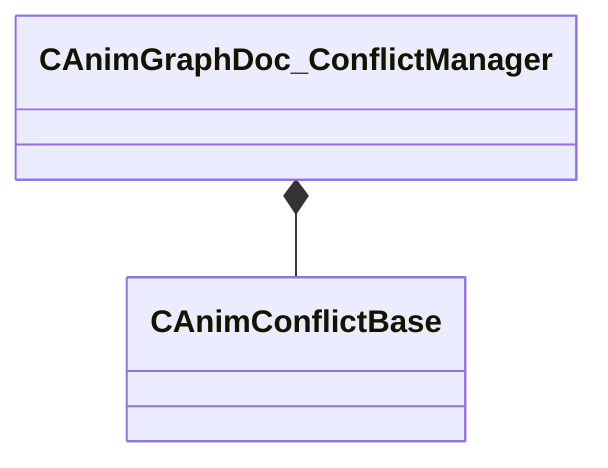

[Schemas](../../schemas.md) / [animgraphdoclib](../animgraphdoclib.md) / CAnimGraphDoc_ConflictManager

# CAnimGraphDoc_ConflictManager

**Kind:** class · **Size:** 56 bytes (`0x38`) · **Align:** 8 · **Module:** animgraphdoclib

**Relationships:**

## Memory layout

1 fields (1 declared here, 0 inherited). Offsets are absolute from the object base.

| Offset | Field | Type | From | Annotations |
|--------|-------|------|------|-------------|
| `0x18` | `m_conflicts` | CUtlVector< CSmartPtr< [CAnimConflictBase](../animgraphdoclib/CAnimConflictBase.md) > > |  |  |

KV3 class defaults

<pre>{
	&quot;_class&quot;: &quot;CAnimGraphDoc_ConflictManager&quot;,
	&quot;m_conflicts&quot;:
	[
	]
}</pre>

