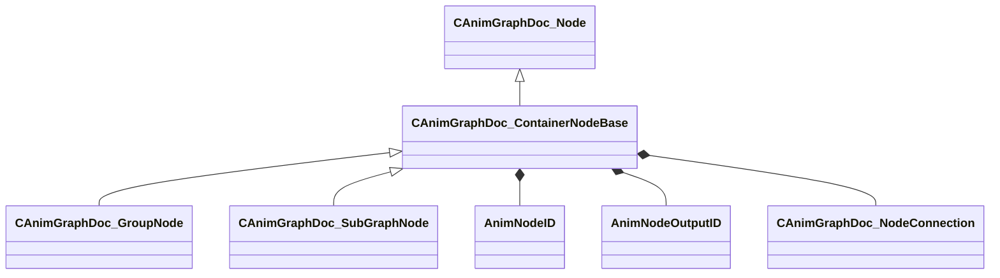

[Schemas](../../schemas.md) / [animgraphdoclib](../animgraphdoclib.md) / CAnimGraphDoc_ContainerNodeBase

# CAnimGraphDoc_ContainerNodeBase

> Source: **Build 25000182** · 2026-08-28 · `windows-x86_64` · schema `0.10.0`

**Kind:** class · **Size:** 112 bytes (`0x70`) · **Align:** n/a (unspecified) · **Module:** animgraphdoclib

**Inherits from:** [CAnimGraphDoc_Node](../animgraphdoclib/CAnimGraphDoc_Node.md)

**Derived by:** [CAnimGraphDoc_GroupNode](../animgraphdoclib/CAnimGraphDoc_GroupNode.md), [CAnimGraphDoc_SubGraphNode](../animgraphdoclib/CAnimGraphDoc_SubGraphNode.md)

**Relationships:**

## Memory layout

8 fields (3 declared here, 5 inherited). Offsets are absolute from the object base.

| Offset | Field | Type | From | Annotations |
|--------|-------|------|------|-------------|
| `0x20` | `m_sName` | CUtlString | [CAnimGraphDoc_Node](../animgraphdoclib/CAnimGraphDoc_Node.md) | `MPropertyFriendlyName Name` `MPropertySortPriority 100` |
| `0x28` | `m_vecPosition` | Vector2D | [CAnimGraphDoc_Node](../animgraphdoclib/CAnimGraphDoc_Node.md) | `MPropertyGroupName Debug` `MPropertySortPriority -100` |
| `0x30` | `m_nNodeID` | [AnimNodeID](../modellib/AnimNodeID.md) | [CAnimGraphDoc_Node](../animgraphdoclib/CAnimGraphDoc_Node.md) | `MPropertyGroupName Debug` `MPropertySortPriority -100` |
| `0x34` | `m_bDebugThisNode` | bool | [CAnimGraphDoc_Node](../animgraphdoclib/CAnimGraphDoc_Node.md) | `MPropertyFriendlyName Debug This Node` `MPropertyGroupName Debug` `MPropertySortPriority -100` |
| `0x38` | `m_networkMode` | [AnimNodeNetworkMode](../animgraphlib/AnimNodeNetworkMode.md) | [CAnimGraphDoc_Node](../animgraphdoclib/CAnimGraphDoc_Node.md) | `MPropertyFriendlyName Network Mode` `MPropertySortPriority -110` |
| `0x48` | `m_inputNodeID` | [AnimNodeID](../modellib/AnimNodeID.md) |  | `MPropertySuppressField` |
| `0x4c` | `m_outputNodeID` | [AnimNodeID](../modellib/AnimNodeID.md) |  | `MPropertySuppressField` |
| `0x50` | `m_inputConnectionMap` | CUtlHashtable< [AnimNodeOutputID](../modellib/AnimNodeOutputID.md), [CAnimGraphDoc_NodeConnection](../animgraphdoclib/CAnimGraphDoc_NodeConnection.md) > |  | `MPropertySuppressField` |
