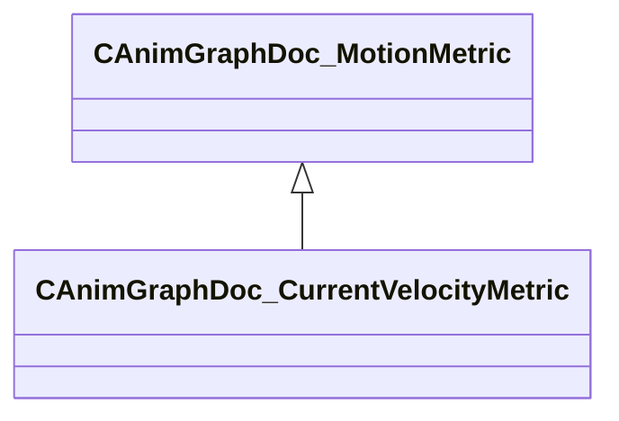

[Schemas](../../schemas.md) / [animgraphdoclib](../animgraphdoclib.md) / CAnimGraphDoc_CurrentVelocityMetric

# CAnimGraphDoc_CurrentVelocityMetric

> Source: **Build 25000182** · 2026-08-28 · `windows-x86_64` · schema `0.10.0`

**Kind:** class · **Size:** 40 bytes (`0x28`) · **Align:** 8 · **Module:** animgraphdoclib

**Inherits from:** [CAnimGraphDoc_MotionMetric](../animgraphdoclib/CAnimGraphDoc_MotionMetric.md)

**Metadata:** `MPropertyFriendlyName Current Velocity Metric`

**Relationships:**

## Memory layout

1 field (0 declared here, 1 inherited). Offsets are absolute from the object base.

| Offset | Field | Type | From | Annotations |
|--------|-------|------|------|-------------|
| `0x20` | `m_flWeight` | float32 | [CAnimGraphDoc_MotionMetric](../animgraphdoclib/CAnimGraphDoc_MotionMetric.md) | `MPropertySuppressField` |

KV3 class defaults

<pre>{
	&quot;_class&quot;: &quot;CAnimGraphDoc_CurrentVelocityMetric&quot;,
	&quot;m_flWeight&quot;: 1.000000
}</pre>

