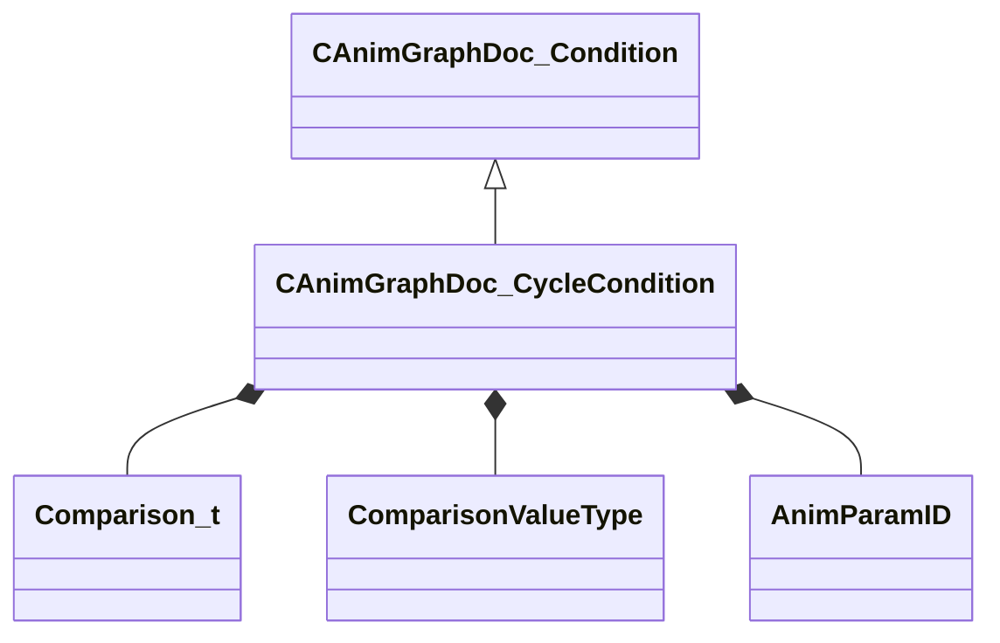

[Schemas](../../schemas.md) / [animgraphdoclib](../animgraphdoclib.md) / CAnimGraphDoc_CycleCondition

# CAnimGraphDoc_CycleCondition

> Source: **Build 25000182** · 2026-08-28 · `windows-x86_64` · schema `0.10.0`

**Kind:** class · **Size:** 80 bytes (`0x50`) · **Align:** 8 · **Module:** animgraphdoclib

**Inherits from:** [CAnimGraphDoc_Condition](../animgraphdoclib/CAnimGraphDoc_Condition.md)

**Metadata:** `MPropertyFriendlyName Cycle Condition`

**Relationships:**

## Memory layout

6 fields (6 declared here, 0 inherited). Offsets are absolute from the object base.

| Offset | Field | Type | From | Annotations |
|--------|-------|------|------|-------------|
| `0x28` | `m_comparisonOp` | [Comparison_t](../animgraphdoclib/Comparison_t.md) |  |  |
| `0x30` | `m_comparisonString` | CUtlString |  |  |
| `0x38` | `m_comparisonValue` | float32 |  |  |
| `0x3c` | `m_comparisonValueType` | [ComparisonValueType](../animgraphdoclib/ComparisonValueType.md) |  |  |
| `0x40` | `m_comparisonParamName` | CUtlString |  |  |
| `0x48` | `m_comparisonParamID` | [AnimParamID](../modellib/AnimParamID.md) |  |  |

KV3 class defaults

<pre>{
	&quot;_class&quot;: &quot;CAnimGraphDoc_CycleCondition&quot;,
	&quot;m_comparisonOp&quot;: &quot;COMPARISON_EQUALS&quot;,
	&quot;m_comparisonString&quot;: &quot;&quot;,
	&quot;m_comparisonValue&quot;: 0.000000,
	&quot;m_comparisonValueType&quot;: &quot;COMPARISONVALUETYPE_FIXEDVALUE&quot;,
	&quot;m_comparisonParamName&quot;: &quot;&quot;,
	&quot;m_comparisonParamID&quot;:
	{
		&quot;m_id&quot;: &lt;HIDDEN FOR DIFF&gt;,
	}
}</pre>

