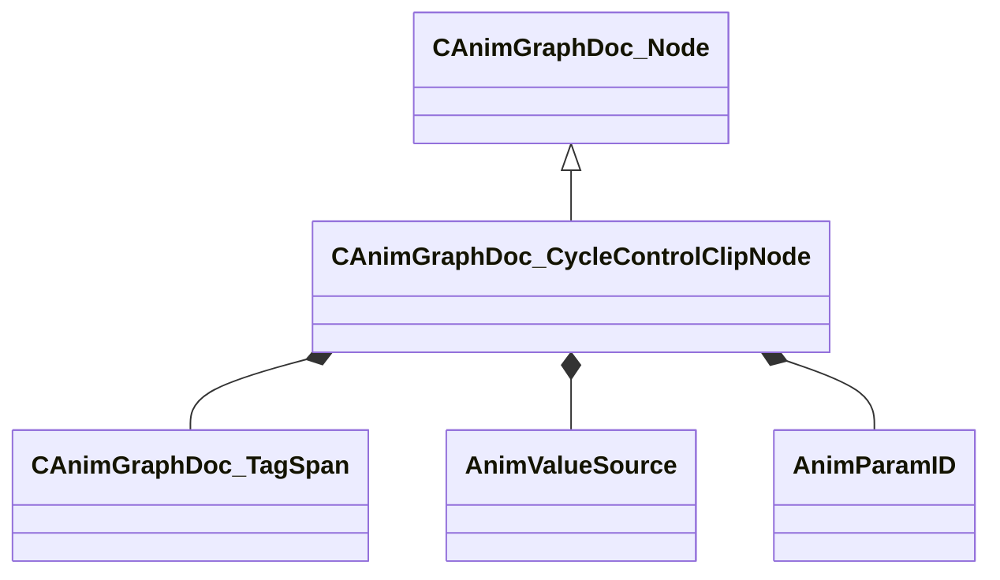

[Schemas](../../schemas.md) / [animgraphdoclib](../animgraphdoclib.md) / CAnimGraphDoc_CycleControlClipNode

# CAnimGraphDoc_CycleControlClipNode

**Kind:** class · **Size:** 144 bytes (`0x90`) · **Align:** 8 · **Module:** animgraphdoclib

**Inherits from:** [CAnimGraphDoc_Node](../animgraphdoclib/CAnimGraphDoc_Node.md)

**Metadata:** `MPropertyFriendlyName Cycle Control Clip`

**Relationships:**

## Memory layout

11 fields (6 declared here, 5 inherited). Offsets are absolute from the object base.

| Offset | Field | Type | From | Annotations |
|--------|-------|------|------|-------------|
| `0x20` | `m_sName` | CUtlString | [CAnimGraphDoc_Node](../animgraphdoclib/CAnimGraphDoc_Node.md) | `MPropertyFriendlyName Name` `MPropertySortPriority 100` |
| `0x28` | `m_vecPosition` | Vector2D | [CAnimGraphDoc_Node](../animgraphdoclib/CAnimGraphDoc_Node.md) | `MPropertyGroupName Debug` `MPropertySortPriority -100` |
| `0x30` | `m_nNodeID` | [AnimNodeID](../modellib/AnimNodeID.md) | [CAnimGraphDoc_Node](../animgraphdoclib/CAnimGraphDoc_Node.md) | `MPropertyGroupName Debug` `MPropertySortPriority -100` |
| `0x34` | `m_bDebugThisNode` | bool | [CAnimGraphDoc_Node](../animgraphdoclib/CAnimGraphDoc_Node.md) | `MPropertyFriendlyName Debug This Node` `MPropertyGroupName Debug` `MPropertySortPriority -100` |
| `0x38` | `m_networkMode` | [AnimNodeNetworkMode](../!GlobalTypes/AnimNodeNetworkMode.md) | [CAnimGraphDoc_Node](../animgraphdoclib/CAnimGraphDoc_Node.md) | `MPropertyFriendlyName Network Mode` `MPropertySortPriority -110` |
| `0x58` | `m_tagSpans` | CUtlVector< CSmartPtr< [CAnimGraphDoc_TagSpan](../animgraphdoclib/CAnimGraphDoc_TagSpan.md) > > |  | `MPropertySuppressField` |
| `0x70` | `m_sequenceName` | CUtlString |  | `MPropertyAttributeChoiceName Sequence` `MPropertyFriendlyName Sequence` |
| `0x78` | `m_valueSource` | [AnimValueSource](../!GlobalTypes/AnimValueSource.md) |  | `MPropertyAttrStateCallback` `MPropertyAutoRebuildOnChange` `MPropertyFriendlyName Blend Source` |
| `0x80` | `m_paramName` | CUtlString |  | `MPropertySuppressField` |
| `0x88` | `m_param` | [AnimParamID](../modellib/AnimParamID.md) |  | `MPropertyAttributeChoiceName FloatParameter` `MPropertyFriendlyName Parameter` |
| `0x8c` | `m_bLockWhenWaning` | bool |  | `MPropertyFriendlyName Lock When Waning` |

KV3 class defaults

<pre>{
	&quot;_class&quot;: &quot;CAnimGraphDoc_CycleControlClipNode&quot;,
	&quot;m_sName&quot;: &quot;Unnamed&quot;,
	&quot;m_vecPosition&quot;:
	[
		0.000000,
		0.000000
	],
	&quot;m_nNodeID&quot;:
	{
		&quot;m_id&quot;: &lt;HIDDEN FOR DIFF&gt;,
	},
	&quot;m_bDebugThisNode&quot;: false,
	&quot;m_networkMode&quot;: &quot;ServerAuthoritative&quot;,
	&quot;m_tagSpans&quot;:
	[
	],
	&quot;m_sequenceName&quot;: &quot;&quot;,
	&quot;m_valueSource&quot;: &quot;Parameter&quot;,
	&quot;m_paramName&quot;: &quot;&quot;,
	&quot;m_param&quot;:
	{
		&quot;m_id&quot;: &lt;HIDDEN FOR DIFF&gt;,
	},
	&quot;m_bLockWhenWaning&quot;: false
}</pre>

