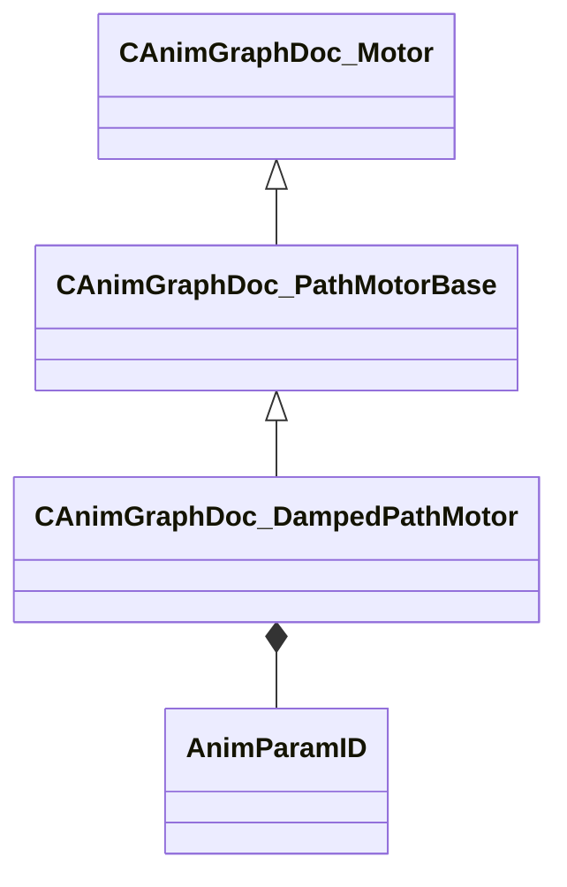

[Schemas](../../schemas.md) / [animgraphdoclib](../animgraphdoclib.md) / CAnimGraphDoc_DampedPathMotor

# CAnimGraphDoc_DampedPathMotor

**Kind:** class · **Size:** 104 bytes (`0x68`) · **Align:** 8 · **Module:** animgraphdoclib

**Inherits from:** [CAnimGraphDoc_PathMotorBase](../animgraphdoclib/CAnimGraphDoc_PathMotorBase.md)

**Metadata:** `MPropertyFriendlyName Damped Path Motor`

**Relationships:**

## Memory layout

12 fields (9 declared here, 3 inherited). Offsets are absolute from the object base.

| Offset | Field | Type | From | Annotations |
|--------|-------|------|------|-------------|
| `0x20` | `m_name` | CUtlString | [CAnimGraphDoc_Motor](../animgraphdoclib/CAnimGraphDoc_Motor.md) | `MPropertyFriendlyName Name` `MPropertySortPriority 100` |
| `0x28` | `m_bDefault` | bool | [CAnimGraphDoc_Motor](../animgraphdoclib/CAnimGraphDoc_Motor.md) | `MPropertyFriendlyName Is Default` |
| `0x30` | `m_bLockToPath` | bool | [CAnimGraphDoc_PathMotorBase](../animgraphdoclib/CAnimGraphDoc_PathMotorBase.md) | `MPropertyFriendlyName Lock To Path` `MPropertySortPriority 90` |
| `0x38` | `m_flAnticipationTime` | float32 |  | `MPropertyFriendlyName Anticipation Time` |
| `0x3c` | `m_flMinSpeedScale` | float32 |  | `MPropertyFriendlyName Minimum Speed Percentage` |
| `0x40` | `m_anticipationPosParamName` | CUtlString |  | `MPropertySuppressField` |
| `0x48` | `m_anticipationPosParam` | [AnimParamID](../modellib/AnimParamID.md) |  | `MPropertyAttributeChoiceName VectorParameter` `MPropertyFriendlyName Anticipation Position Parameter` |
| `0x50` | `m_anticipationHeadingParamName` | CUtlString |  | `MPropertySuppressField` |
| `0x58` | `m_anticipationHeadingParam` | [AnimParamID](../modellib/AnimParamID.md) |  | `MPropertyAttributeChoiceName FloatParameter` `MPropertyFriendlyName Anticipation Heading Parameter` |
| `0x5c` | `m_flSpringConstant` | float32 |  | `MPropertyFriendlyName Spring Constant` `MPropertyGroupName +Stopping:Arrival Damping` |
| `0x60` | `m_flMinSpringTension` | float32 |  | `MPropertyFriendlyName Min Tension` `MPropertyGroupName +Stopping:Arrival Damping` |
| `0x64` | `m_flMaxSpringTension` | float32 |  | `MPropertyFriendlyName Max Tension` `MPropertyGroupName +Stopping:Arrival Damping` |

KV3 class defaults

<pre>{
	&quot;_class&quot;: &quot;CAnimGraphDoc_DampedPathMotor&quot;,
	&quot;m_name&quot;: &quot;Unnamed Motor&quot;,
	&quot;m_bDefault&quot;: false,
	&quot;m_bLockToPath&quot;: true,
	&quot;m_flAnticipationTime&quot;: 1.000000,
	&quot;m_flMinSpeedScale&quot;: 0.250000,
	&quot;m_anticipationPosParamName&quot;: &quot;&quot;,
	&quot;m_anticipationPosParam&quot;:
	{
		&quot;m_id&quot;: &lt;HIDDEN FOR DIFF&gt;,
	},
	&quot;m_anticipationHeadingParamName&quot;: &quot;&quot;,
	&quot;m_anticipationHeadingParam&quot;:
	{
		&quot;m_id&quot;: &lt;HIDDEN FOR DIFF&gt;,
	},
	&quot;m_flSpringConstant&quot;: 10.000000,
	&quot;m_flMinSpringTension&quot;: 1.000000,
	&quot;m_flMaxSpringTension&quot;: 100.000000
}</pre>

