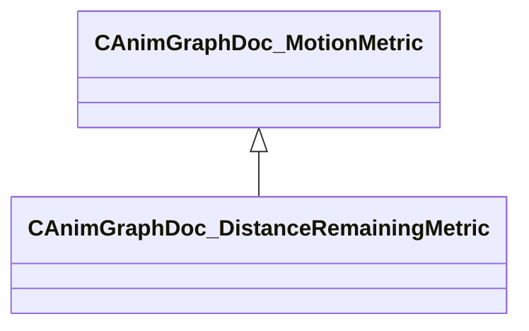

[Schemas](../../schemas.md) / [animgraphdoclib](../animgraphdoclib.md) / CAnimGraphDoc_DistanceRemainingMetric

# CAnimGraphDoc_DistanceRemainingMetric

> Source: **Build 25000182** · 2026-08-28 · `windows-x86_64` · schema `0.10.0`

**Kind:** class · **Size:** 72 bytes (`0x48`) · **Align:** 8 · **Module:** animgraphdoclib

**Inherits from:** [CAnimGraphDoc_MotionMetric](../animgraphdoclib/CAnimGraphDoc_MotionMetric.md)

**Metadata:** `MPropertyFriendlyName Distance Remaining Metric`

**Relationships:**

## Memory layout

8 fields (7 declared here, 1 inherited). Offsets are absolute from the object base.

| Offset | Field | Type | From | Annotations |
|--------|-------|------|------|-------------|
| `0x20` | `m_flWeight` | float32 | [CAnimGraphDoc_MotionMetric](../animgraphdoclib/CAnimGraphDoc_MotionMetric.md) | `MPropertySuppressField` |
| `0x28` | `m_flMaxDistance` | float32 |  | `MPropertyFriendlyName Maximum Tracked Distance` |
| `0x2c` | `m_bFilterFixedMinDistance` | bool |  | `MPropertyAutoRebuildOnChange` `MPropertyFriendlyName Filter By Fixed Distance` |
| `0x30` | `m_flMinDistance` | float32 |  | `MPropertyAttrStateCallback` `MPropertyFriendlyName Min Distance` |
| `0x34` | `m_bFilterGoalDistance` | bool |  | `MPropertyAutoRebuildOnChange` `MPropertyFriendlyName Filter By Goal Distance` |
| `0x38` | `m_flStartGoalFilterDistance` | float32 |  | `MPropertyAttrStateCallback` `MPropertyFriendlyName Goal Filter Start Distance` |
| `0x3c` | `m_bFilterGoalOvershoot` | bool |  | `MPropertyAttrStateCallback` `MPropertyAutoRebuildOnChange` `MPropertyFriendlyName Filter By Goal Overshoot` |
| `0x40` | `m_flMaxGoalOvershootScale` | float32 |  | `MPropertyAttrStateCallback` `MPropertyFriendlyName Max Goal Overshoot Scale` |

KV3 class defaults

<pre>{
	&quot;_class&quot;: &quot;CAnimGraphDoc_DistanceRemainingMetric&quot;,
	&quot;m_flWeight&quot;: 1.000000,
	&quot;m_flMaxDistance&quot;: 300.000000,
	&quot;m_bFilterFixedMinDistance&quot;: true,
	&quot;m_flMinDistance&quot;: 0.000000,
	&quot;m_bFilterGoalDistance&quot;: true,
	&quot;m_flStartGoalFilterDistance&quot;: 150.000000,
	&quot;m_bFilterGoalOvershoot&quot;: false,
	&quot;m_flMaxGoalOvershootScale&quot;: 2.000000
}</pre>

