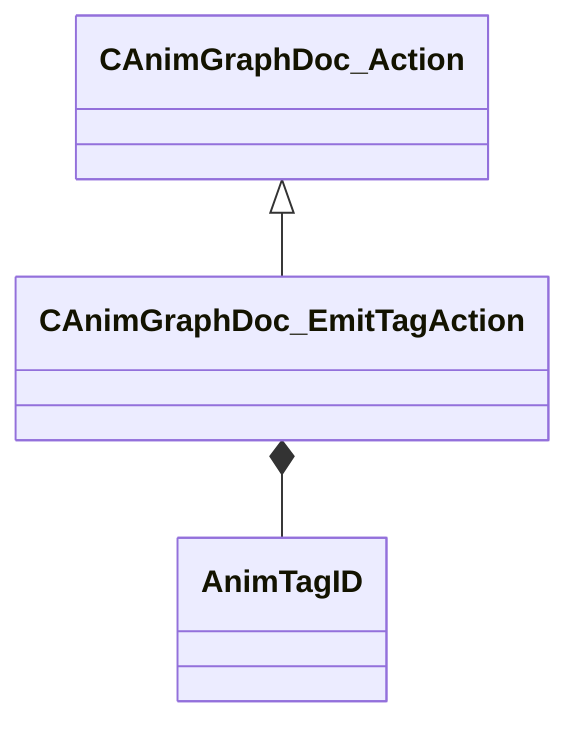

[Schemas](../../schemas.md) / [animgraphdoclib](../animgraphdoclib.md) / CAnimGraphDoc_EmitTagAction

# CAnimGraphDoc_EmitTagAction

> Source: **Build 25000182** · 2026-08-28 · `windows-x86_64` · schema `0.10.0`

**Kind:** class · **Size:** 48 bytes (`0x30`) · **Align:** 8 · **Module:** animgraphdoclib

**Inherits from:** [CAnimGraphDoc_Action](../animgraphdoclib/CAnimGraphDoc_Action.md)

**Relationships:**

## Memory layout

1 field (1 declared here, 0 inherited). Offsets are absolute from the object base.

| Offset | Field | Type | From | Annotations |
|--------|-------|------|------|-------------|
| `0x28` | `m_tag` | [AnimTagID](../modellib/AnimTagID.md) |  | `MPropertyAttributeChoiceName Tag` `MPropertyFriendlyName Tag` |

KV3 class defaults

<pre>{
	&quot;_class&quot;: &quot;CAnimGraphDoc_EmitTagAction&quot;,
	&quot;m_tag&quot;:
	{
		&quot;m_id&quot;: &lt;HIDDEN FOR DIFF&gt;,
	}
}</pre>

