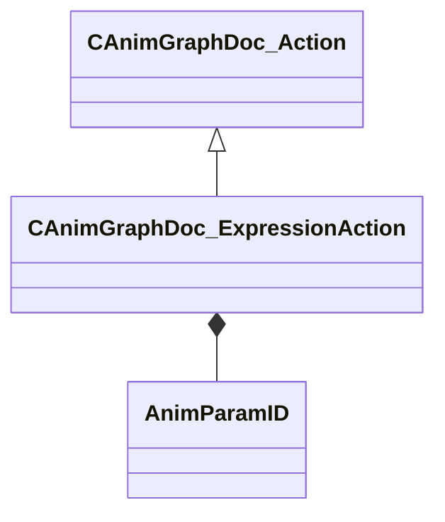

[Schemas](../../schemas.md) / [animgraphdoclib](../animgraphdoclib.md) / CAnimGraphDoc_ExpressionAction

# CAnimGraphDoc_ExpressionAction

> Source: **Build 25000182** · 2026-08-28 · `windows-x86_64` · schema `0.10.0`

**Kind:** class · **Size:** 64 bytes (`0x40`) · **Align:** 8 · **Module:** animgraphdoclib

**Inherits from:** [CAnimGraphDoc_Action](../animgraphdoclib/CAnimGraphDoc_Action.md)

**Relationships:**

## Memory layout

3 fields (3 declared here, 0 inherited). Offsets are absolute from the object base.

| Offset | Field | Type | From | Annotations |
|--------|-------|------|------|-------------|
| `0x28` | `m_paramName` | CUtlString |  |  |
| `0x30` | `m_param` | [AnimParamID](../modellib/AnimParamID.md) |  |  |
| `0x38` | `m_expression` | CUtlString |  |  |

KV3 class defaults

<pre>{
	&quot;_class&quot;: &quot;CAnimGraphDoc_ExpressionAction&quot;,
	&quot;m_paramName&quot;: &quot;&quot;,
	&quot;m_param&quot;:
	{
		&quot;m_id&quot;: &lt;HIDDEN FOR DIFF&gt;,
	},
	&quot;m_expression&quot;: &quot;&quot;
}</pre>

