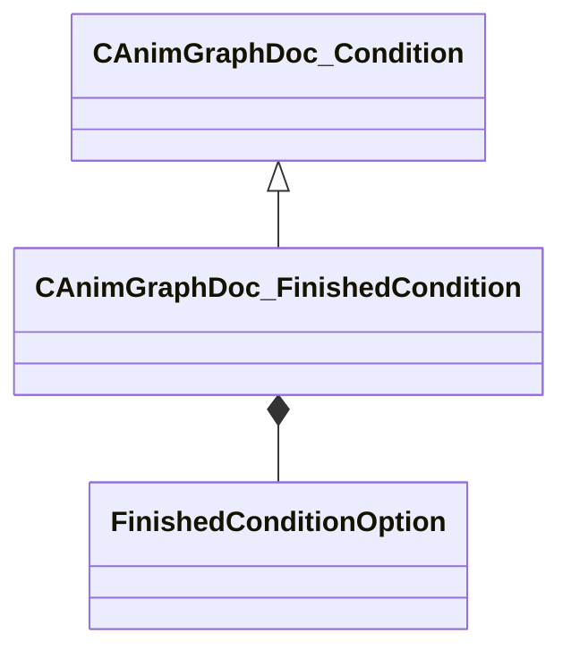

[Schemas](../../schemas.md) / [animgraphdoclib](../animgraphdoclib.md) / CAnimGraphDoc_FinishedCondition

# CAnimGraphDoc_FinishedCondition

> Source: **Build 25000182** · 2026-08-28 · `windows-x86_64` · schema `0.10.0`

**Kind:** class · **Size:** 48 bytes (`0x30`) · **Align:** 8 · **Module:** animgraphdoclib

**Inherits from:** [CAnimGraphDoc_Condition](../animgraphdoclib/CAnimGraphDoc_Condition.md)

**Metadata:** `MPropertyFriendlyName Finished Condition`

**Relationships:**

## Memory layout

2 fields (2 declared here, 0 inherited). Offsets are absolute from the object base.

| Offset | Field | Type | From | Annotations |
|--------|-------|------|------|-------------|
| `0x28` | `m_option` | [FinishedConditionOption](../animgraphdoclib/FinishedConditionOption.md) |  |  |
| `0x2c` | `m_bIsFinished` | bool |  |  |

KV3 class defaults

<pre>{
	&quot;_class&quot;: &quot;CAnimGraphDoc_FinishedCondition&quot;,
	&quot;m_option&quot;: &quot;FinishedConditionOption_OnFinished&quot;,
	&quot;m_bIsFinished&quot;: true
}</pre>

