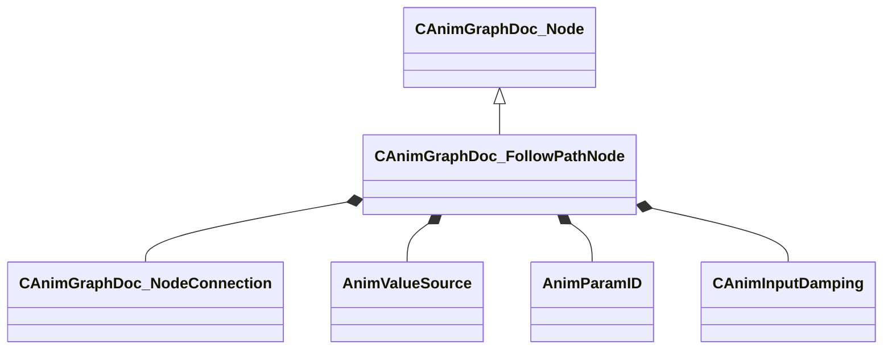

[Schemas](../../schemas.md) / [animgraphdoclib](../animgraphdoclib.md) / CAnimGraphDoc_FollowPathNode

# CAnimGraphDoc_FollowPathNode

**Kind:** class · **Size:** 144 bytes (`0x90`) · **Align:** 8 · **Module:** animgraphdoclib

**Inherits from:** [CAnimGraphDoc_Node](../animgraphdoclib/CAnimGraphDoc_Node.md)

**Metadata:** `MPropertyFriendlyName Follow Path`

**Relationships:**

## Memory layout

20 fields (15 declared here, 5 inherited). Offsets are absolute from the object base.

| Offset | Field | Type | From | Annotations |
|--------|-------|------|------|-------------|
| `0x20` | `m_sName` | CUtlString | [CAnimGraphDoc_Node](../animgraphdoclib/CAnimGraphDoc_Node.md) | `MPropertyFriendlyName Name` `MPropertySortPriority 100` |
| `0x28` | `m_vecPosition` | Vector2D | [CAnimGraphDoc_Node](../animgraphdoclib/CAnimGraphDoc_Node.md) | `MPropertyGroupName Debug` `MPropertySortPriority -100` |
| `0x30` | `m_nNodeID` | [AnimNodeID](../modellib/AnimNodeID.md) | [CAnimGraphDoc_Node](../animgraphdoclib/CAnimGraphDoc_Node.md) | `MPropertyGroupName Debug` `MPropertySortPriority -100` |
| `0x34` | `m_bDebugThisNode` | bool | [CAnimGraphDoc_Node](../animgraphdoclib/CAnimGraphDoc_Node.md) | `MPropertyFriendlyName Debug This Node` `MPropertyGroupName Debug` `MPropertySortPriority -100` |
| `0x38` | `m_networkMode` | [AnimNodeNetworkMode](../!GlobalTypes/AnimNodeNetworkMode.md) | [CAnimGraphDoc_Node](../animgraphdoclib/CAnimGraphDoc_Node.md) | `MPropertyFriendlyName Network Mode` `MPropertySortPriority -110` |
| `0x40` | `m_inputConnection` | [CAnimGraphDoc_NodeConnection](../animgraphdoclib/CAnimGraphDoc_NodeConnection.md) |  | `MPropertySuppressField` |
| `0x48` | `m_flBlendOutTime` | float32 |  | `MPropertyFriendlyName Blend Out Time` |
| `0x4c` | `m_bBlockNonPathMovement` | bool |  | `MPropertyFriendlyName Block Non-Path Movement` |
| `0x4d` | `m_bStopFeetAtGoal` | bool |  | `MPropertyFriendlyName Stop Feet at Goal` |
| `0x4e` | `m_bScaleSpeed` | bool |  | `MPropertyAutoRebuildOnChange` `MPropertyFriendlyName Enable Speed Scaling` `MPropertyGroupName Speed Scaling` |
| `0x50` | `m_flScale` | float32 |  | `MPropertyAttrStateCallback` `MPropertyAttributeRange 0 1` `MPropertyFriendlyName Scale` `MPropertyGroupName Speed Scaling` |
| `0x54` | `m_flMinAngle` | float32 |  | `MPropertyAttrStateCallback` `MPropertyAttributeRange 0 180` `MPropertyFriendlyName Min Angle` `MPropertyGroupName Speed Scaling` |
| `0x58` | `m_flMaxAngle` | float32 |  | `MPropertyAttrStateCallback` `MPropertyAttributeRange 0 180` `MPropertyFriendlyName Max Angle` `MPropertyGroupName Speed Scaling` |
| `0x5c` | `m_flSpeedScaleBlending` | float32 |  | `MPropertyAttrStateCallback` `MPropertyFriendlyName Blend Time` `MPropertyGroupName Speed Scaling` |
| `0x60` | `m_bTurnToFace` | bool |  | `MPropertyAutoRebuildOnChange` `MPropertyFriendlyName Enable Turn to Face` `MPropertyGroupName Turn to Face` |
| `0x64` | `m_facingTarget` | [AnimValueSource](../!GlobalTypes/AnimValueSource.md) |  | `MPropertyAttrStateCallback` `MPropertyAutoRebuildOnChange` `MPropertyFriendlyName Target` `MPropertyGroupName Turn to Face` |
| `0x68` | `m_paramName` | CUtlString |  | `MPropertySuppressField` |
| `0x70` | `m_param` | [AnimParamID](../modellib/AnimParamID.md) |  | `MPropertyAttrStateCallback` `MPropertyAttributeChoiceName FloatParameter` `MPropertyFriendlyName Parameter` `MPropertyGroupName Turn to Face` |
| `0x74` | `m_flTurnToFaceOffset` | float32 |  | `MPropertyAttrStateCallback` `MPropertyAttributeRange -180 180` `MPropertyFriendlyName Offset` `MPropertyGroupName Turn to Face` |
| `0x78` | `m_damping` | [CAnimInputDamping](../animgraphlib/CAnimInputDamping.md) |  | `MPropertyAttrStateCallback` `MPropertyFriendlyName Damping` `MPropertyGroupName Turn to Face` |

KV3 class defaults

<pre>{
	&quot;_class&quot;: &quot;CAnimGraphDoc_FollowPathNode&quot;,
	&quot;m_sName&quot;: &quot;Unnamed&quot;,
	&quot;m_vecPosition&quot;:
	[
		0.000000,
		0.000000
	],
	&quot;m_nNodeID&quot;:
	{
		&quot;m_id&quot;: &lt;HIDDEN FOR DIFF&gt;,
	},
	&quot;m_bDebugThisNode&quot;: false,
	&quot;m_networkMode&quot;: &quot;ServerAuthoritative&quot;,
	&quot;m_inputConnection&quot;:
	{
		&quot;m_nodeID&quot;:
		{
			&quot;m_id&quot;: &lt;HIDDEN FOR DIFF&gt;,
		},
		&quot;m_outputID&quot;:
		{
			&quot;m_id&quot;: &lt;HIDDEN FOR DIFF&gt;,
		}
	},
	&quot;m_flBlendOutTime&quot;: 0.300000,
	&quot;m_bBlockNonPathMovement&quot;: false,
	&quot;m_bStopFeetAtGoal&quot;: true,
	&quot;m_bScaleSpeed&quot;: false,
	&quot;m_flScale&quot;: 0.500000,
	&quot;m_flMinAngle&quot;: 0.000000,
	&quot;m_flMaxAngle&quot;: 180.000000,
	&quot;m_flSpeedScaleBlending&quot;: 0.200000,
	&quot;m_bTurnToFace&quot;: true,
	&quot;m_facingTarget&quot;: &quot;MoveHeading&quot;,
	&quot;m_paramName&quot;: &quot;&quot;,
	&quot;m_param&quot;:
	{
		&quot;m_id&quot;: &lt;HIDDEN FOR DIFF&gt;,
	},
	&quot;m_flTurnToFaceOffset&quot;: 0.000000,
	&quot;m_damping&quot;:
	{
		&quot;_class&quot;: &quot;CAnimInputDamping&quot;,
		&quot;m_speedFunction&quot;: &quot;NoDamping&quot;,
		&quot;m_fSpeedScale&quot;: 1.000000,
		&quot;m_fFallingSpeedScale&quot;: 1.000000
	}
}</pre>

