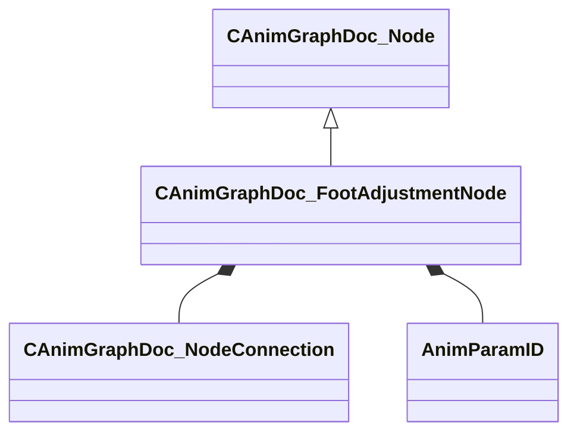

[Schemas](../../schemas.md) / [animgraphdoclib](../animgraphdoclib.md) / CAnimGraphDoc_FootAdjustmentNode

# CAnimGraphDoc_FootAdjustmentNode

**Kind:** class · **Size:** 136 bytes (`0x88`) · **Align:** 8 · **Module:** animgraphdoclib

**Inherits from:** [CAnimGraphDoc_Node](../animgraphdoclib/CAnimGraphDoc_Node.md)

**Metadata:** `MPropertyFriendlyName Foot Adjustment`

**Relationships:**

## Memory layout

16 fields (11 declared here, 5 inherited). Offsets are absolute from the object base.

| Offset | Field | Type | From | Annotations |
|--------|-------|------|------|-------------|
| `0x20` | `m_sName` | CUtlString | [CAnimGraphDoc_Node](../animgraphdoclib/CAnimGraphDoc_Node.md) | `MPropertyFriendlyName Name` `MPropertySortPriority 100` |
| `0x28` | `m_vecPosition` | Vector2D | [CAnimGraphDoc_Node](../animgraphdoclib/CAnimGraphDoc_Node.md) | `MPropertyGroupName Debug` `MPropertySortPriority -100` |
| `0x30` | `m_nNodeID` | [AnimNodeID](../modellib/AnimNodeID.md) | [CAnimGraphDoc_Node](../animgraphdoclib/CAnimGraphDoc_Node.md) | `MPropertyGroupName Debug` `MPropertySortPriority -100` |
| `0x34` | `m_bDebugThisNode` | bool | [CAnimGraphDoc_Node](../animgraphdoclib/CAnimGraphDoc_Node.md) | `MPropertyFriendlyName Debug This Node` `MPropertyGroupName Debug` `MPropertySortPriority -100` |
| `0x38` | `m_networkMode` | [AnimNodeNetworkMode](../animgraphlib/AnimNodeNetworkMode.md) | [CAnimGraphDoc_Node](../animgraphdoclib/CAnimGraphDoc_Node.md) | `MPropertyFriendlyName Network Mode` `MPropertySortPriority -110` |
| `0x40` | `m_inputConnection` | [CAnimGraphDoc_NodeConnection](../animgraphdoclib/CAnimGraphDoc_NodeConnection.md) |  | `MPropertySuppressField` |
| `0x48` | `m_facingTargetParam` | CUtlString |  | `MPropertySuppressField` |
| `0x50` | `m_facingTarget` | [AnimParamID](../modellib/AnimParamID.md) |  | `MPropertyAttributeChoiceName FloatParameter` `MPropertyFriendlyName Turn to Face` |
| `0x54` | `m_bResetChild` | bool |  | `MPropertyFriendlyName Reset Child` |
| `0x55` | `m_bAnimationDriven` | bool |  | `MPropertyAutoRebuildOnChange` `MPropertyFriendlyName Animation Driven` |
| `0x58` | `m_baseClipName` | CUtlString |  | `MPropertyAttrStateCallback` `MPropertyAttributeChoiceName Sequence` `MPropertyFriendlyName Base Anim Clips` `MPropertyGroupName Anim Driven Settings` |
| `0x60` | `m_clips` | CUtlVector< CUtlString > |  | `MPropertyAttrStateCallback` `MPropertyAttributeChoiceName Sequence` `MPropertyFriendlyName Clips` `MPropertyGroupName Anim Driven Settings` |
| `0x78` | `m_flTurnTimeMin` | float32 |  | `MPropertyAttrStateCallback` `MPropertyFriendlyName Turn Time Min` `MPropertyGroupName Procedural Settings` |
| `0x7c` | `m_flTurnTimeMax` | float32 |  | `MPropertyAttrStateCallback` `MPropertyFriendlyName Turn Time Max` `MPropertyGroupName Procedural Settings` |
| `0x80` | `m_flStepHeightMax` | float32 |  | `MPropertyAttrStateCallback` `MPropertyFriendlyName Step Height Max` `MPropertyGroupName Procedural Settings` |
| `0x84` | `m_flStepHeightMaxAngle` | float32 |  | `MPropertyAttrStateCallback` `MPropertyFriendlyName Step Height Max Angle` `MPropertyGroupName Procedural Settings` |

KV3 class defaults

<pre>{
	&quot;_class&quot;: &quot;CAnimGraphDoc_FootAdjustmentNode&quot;,
	&quot;m_sName&quot;: &quot;Unnamed&quot;,
	&quot;m_vecPosition&quot;:
	[
		0.000000,
		0.000000
	],
	&quot;m_nNodeID&quot;:
	{
		&quot;m_id&quot;: &lt;HIDDEN FOR DIFF&gt;,
	},
	&quot;m_bDebugThisNode&quot;: false,
	&quot;m_networkMode&quot;: &quot;ServerAuthoritative&quot;,
	&quot;m_inputConnection&quot;:
	{
		&quot;m_nodeID&quot;:
		{
			&quot;m_id&quot;: &lt;HIDDEN FOR DIFF&gt;,
		},
		&quot;m_outputID&quot;:
		{
			&quot;m_id&quot;: &lt;HIDDEN FOR DIFF&gt;,
		}
	},
	&quot;m_facingTargetParam&quot;: &quot;&quot;,
	&quot;m_facingTarget&quot;:
	{
		&quot;m_id&quot;: &lt;HIDDEN FOR DIFF&gt;,
	},
	&quot;m_bResetChild&quot;: true,
	&quot;m_bAnimationDriven&quot;: false,
	&quot;m_baseClipName&quot;: &quot;&quot;,
	&quot;m_clips&quot;:
	[
	],
	&quot;m_flTurnTimeMin&quot;: 1.500000,
	&quot;m_flTurnTimeMax&quot;: 3.000000,
	&quot;m_flStepHeightMax&quot;: 4.000000,
	&quot;m_flStepHeightMaxAngle&quot;: 90.000000
}</pre>

