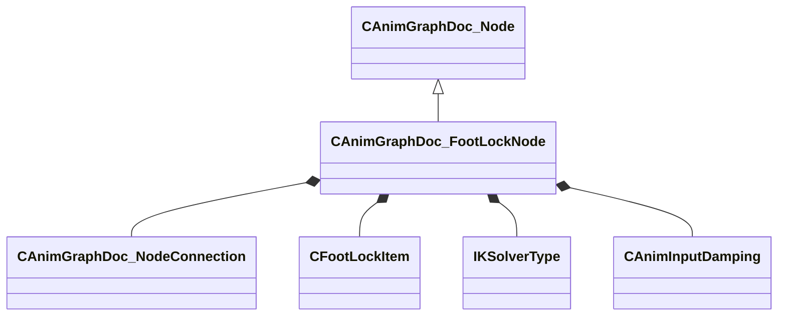

[Schemas](../../schemas.md) / [animgraphdoclib](../animgraphdoclib.md) / CAnimGraphDoc_FootLockNode

# CAnimGraphDoc_FootLockNode

**Kind:** class · **Size:** 296 bytes (`0x128`) · **Align:** 8 · **Module:** animgraphdoclib

**Inherits from:** [CAnimGraphDoc_Node](../animgraphdoclib/CAnimGraphDoc_Node.md)

**Metadata:** `MPropertyFriendlyName Stride Retargeting`

**Relationships:**

## Memory layout

43 fields (38 declared here, 5 inherited). Offsets are absolute from the object base.

| Offset | Field | Type | From | Annotations |
|--------|-------|------|------|-------------|
| `0x20` | `m_sName` | CUtlString | [CAnimGraphDoc_Node](../animgraphdoclib/CAnimGraphDoc_Node.md) | `MPropertyFriendlyName Name` `MPropertySortPriority 100` |
| `0x28` | `m_vecPosition` | Vector2D | [CAnimGraphDoc_Node](../animgraphdoclib/CAnimGraphDoc_Node.md) | `MPropertyGroupName Debug` `MPropertySortPriority -100` |
| `0x30` | `m_nNodeID` | [AnimNodeID](../modellib/AnimNodeID.md) | [CAnimGraphDoc_Node](../animgraphdoclib/CAnimGraphDoc_Node.md) | `MPropertyGroupName Debug` `MPropertySortPriority -100` |
| `0x34` | `m_bDebugThisNode` | bool | [CAnimGraphDoc_Node](../animgraphdoclib/CAnimGraphDoc_Node.md) | `MPropertyFriendlyName Debug This Node` `MPropertyGroupName Debug` `MPropertySortPriority -100` |
| `0x38` | `m_networkMode` | [AnimNodeNetworkMode](../animgraphlib/AnimNodeNetworkMode.md) | [CAnimGraphDoc_Node](../animgraphdoclib/CAnimGraphDoc_Node.md) | `MPropertyFriendlyName Network Mode` `MPropertySortPriority -110` |
| `0x40` | `m_inputConnection` | [CAnimGraphDoc_NodeConnection](../animgraphdoclib/CAnimGraphDoc_NodeConnection.md) |  | `MPropertySuppressField` |
| `0x48` | `m_items` | CUtlVector< [CFootLockItem](../animgraphdoclib/CFootLockItem.md) > |  | `MPropertyAutoExpandSelf` `MPropertyFriendlyName Feet` |
| `0x60` | `m_hipBoneName` | CUtlString |  | `MPropertyAttributeChoiceName Bone` `MPropertyFriendlyName Hip Bone` |
| `0x68` | `m_flBlendTime` | float32 |  | `MPropertyFriendlyName Blend Time` |
| `0x6c` | `m_bApplyFootRotationLimits` | bool |  | `MPropertyFriendlyName Apply Foot Rotation Limits` |
| `0x6d` | `m_bResetChild` | bool |  | `MPropertyFriendlyName Reset Child` |
| `0x70` | `m_ikSolverType` | [IKSolverType](../animgraphlib/IKSolverType.md) |  | `MPropertyAutoRebuildOnChange` `MPropertyFriendlyName IK Solver Type` `MPropertyGroupName IK` |
| `0x74` | `m_bAlwaysUseFallbackHinge` | bool |  | `MPropertyAttrStateCallback` `MPropertyFriendlyName Always use fallback hinge` `MPropertyGroupName IK` |
| `0x75` | `m_bApplyLegTwistLimits` | bool |  | `MPropertyAttrStateCallback` `MPropertyFriendlyName Limit Leg Twist` `MPropertyGroupName IK` |
| `0x78` | `m_flMaxLegTwist` | float32 |  | `MPropertyAttrStateCallback` `MPropertyFriendlyName Max Leg Twist Angle` `MPropertyGroupName IK` |
| `0x7c` | `m_flStrideCurveScale` | float32 |  | `MPropertyAttributeRange 0 1` `MPropertyFriendlyName Curve Foot Paths` `MPropertyGroupName Curve Paths` |
| `0x80` | `m_flStrideCurveLimitScale` | float32 |  | `MPropertyAttributeRange 0 1` `MPropertyFriendlyName Curve Paths Limit` `MPropertyGroupName Curve Paths` |
| `0x84` | `m_bEnableVerticalCurvedPaths` | bool |  | `MPropertyFriendlyName Enable Vertical Curved Paths` `MPropertyGroupName Curve Paths` |
| `0x85` | `m_bModulateStepHeight` | bool |  | `MPropertyAutoRebuildOnChange` `MPropertyFriendlyName Modulate Step Height` `MPropertyGroupName Step Height` |
| `0x88` | `m_flStepHeightIncreaseScale` | float32 |  | `MPropertyAttrStateCallback` `MPropertyFriendlyName Height Increase Scale` `MPropertyGroupName Step Height` |
| `0x8c` | `m_flStepHeightDecreaseScale` | float32 |  | `MPropertyAttrStateCallback` `MPropertyFriendlyName Height Decrease Scale` `MPropertyGroupName Step Height` |
| `0x90` | `m_bEnableHipShift` | bool |  | `MPropertyFriendlyName Enable Hip Shift` `MPropertyGroupName Hip Shift` |
| `0x94` | `m_flHipShiftScale` | float32 |  | `MPropertyAttributeRange 0 1` `MPropertyFriendlyName Hip Shift Scale` `MPropertyGroupName Hip Shift` |
| `0x98` | `m_hipShiftDamping` | [CAnimInputDamping](../animgraphlib/CAnimInputDamping.md) |  | `MPropertyFriendlyName Damping` `MPropertyGroupName Hip Shift` |
| `0xb0` | `m_bApplyTilt` | bool |  | `MPropertyFriendlyName Apply Tilt` `MPropertyGroupName Tilt` |
| `0xb4` | `m_flTiltPlanePitchSpringStrength` | float32 |  | `MPropertyFriendlyName Tilt Plane Pitch Spring Strength` `MPropertyGroupName Tilt` |
| `0xb8` | `m_flTiltPlaneRollSpringStrength` | float32 |  | `MPropertyFriendlyName Tilt Plane Roll Spring Strength` `MPropertyGroupName Tilt` |
| `0xbc` | `m_bEnableLockBreaking` | bool |  | `MPropertyFriendlyName Enable Lock Breaking` `MPropertyGroupName Lock Breaking` |
| `0xc0` | `m_flLockBreakTolerance` | float32 |  | `MPropertyFriendlyName Tolerance` `MPropertyGroupName Lock Breaking` |
| `0xc4` | `m_flLockBreakBlendTime` | float32 |  | `MPropertyFriendlyName Blend Time` `MPropertyGroupName Lock Breaking` |
| `0xc8` | `m_bEnableStretching` | bool |  | `MPropertyFriendlyName Enable Stretching` `MPropertyGroupName Stretch` |
| `0xcc` | `m_flMaxStretchAmount` | float32 |  | `MPropertyFriendlyName Max Stretch Amount` `MPropertyGroupName Stretch` |
| `0xd0` | `m_flStretchExtensionScale` | float32 |  | `MPropertyAttributeRange 0 1` `MPropertyFriendlyName Extension Scale` `MPropertyGroupName Stretch` |
| `0xd4` | `m_bEnableGroundTracing` | bool |  | `MPropertyAutoRebuildOnChange` `MPropertyFriendlyName Enable Ground Tracing` `MPropertyGroupName Ground IK` |
| `0xd8` | `m_flTraceAngleBlend` | float32 |  | `MPropertyAttrStateCallback` `MPropertyAttributeRange 0 1` `MPropertyFriendlyName Angle Traces with Slope` `MPropertyGroupName Ground IK` |
| `0xdc` | `m_bApplyHipDrop` | bool |  | `MPropertyAttrStateCallback` `MPropertyAutoRebuildOnChange` `MPropertyFriendlyName Apply Hip Drop` `MPropertyGroupName Ground IK` |
| `0xe0` | `m_flMaxFootHeight` | float32 |  | `MPropertyAttrStateCallback` `MPropertyFriendlyName Max Foot Lift` `MPropertyGroupName Ground IK` |
| `0xe4` | `m_flExtensionScale` | float32 |  | `MPropertyAttrStateCallback` `MPropertyFriendlyName Leg Extension Scale` `MPropertyGroupName Ground IK` |
| `0xe8` | `m_hipDampingSettings` | [CAnimInputDamping](../animgraphlib/CAnimInputDamping.md) |  | `MPropertyAttrStateCallback` `MPropertyFriendlyName Hip Damping` `MPropertyGroupName Ground IK` |
| `0x100` | `m_bEnableRootHeightDamping` | bool |  | `MPropertyAutoRebuildOnChange` `MPropertyFriendlyName Enable Root Height Damping` `MPropertyGroupName Root Height Damping` |
| `0x108` | `m_rootHeightDamping` | [CAnimInputDamping](../animgraphlib/CAnimInputDamping.md) |  | `MPropertyAttrStateCallback` `MPropertyFriendlyName Damping Settings` `MPropertyGroupName Root Height Damping` |
| `0x120` | `m_flMaxRootHeightOffset` | float32 |  | `MPropertyAttrStateCallback` `MPropertyFriendlyName Max Offset` `MPropertyGroupName Root Height Damping` |
| `0x124` | `m_flMinRootHeightOffset` | float32 |  | `MPropertyAttrStateCallback` `MPropertyFriendlyName Min Offset` `MPropertyGroupName Root Height Damping` |

KV3 class defaults

<pre>{
	&quot;_class&quot;: &quot;CAnimGraphDoc_FootLockNode&quot;,
	&quot;m_sName&quot;: &quot;Unnamed&quot;,
	&quot;m_vecPosition&quot;:
	[
		0.000000,
		0.000000
	],
	&quot;m_nNodeID&quot;:
	{
		&quot;m_id&quot;: &lt;HIDDEN FOR DIFF&gt;,
	},
	&quot;m_bDebugThisNode&quot;: false,
	&quot;m_networkMode&quot;: &quot;ServerAuthoritative&quot;,
	&quot;m_inputConnection&quot;:
	{
		&quot;m_nodeID&quot;:
		{
			&quot;m_id&quot;: &lt;HIDDEN FOR DIFF&gt;,
		},
		&quot;m_outputID&quot;:
		{
			&quot;m_id&quot;: &lt;HIDDEN FOR DIFF&gt;,
		}
	},
	&quot;m_items&quot;:
	[
	],
	&quot;m_hipBoneName&quot;: &quot;&quot;,
	&quot;m_flBlendTime&quot;: 0.200000,
	&quot;m_bApplyFootRotationLimits&quot;: true,
	&quot;m_bResetChild&quot;: true,
	&quot;m_ikSolverType&quot;: &quot;IKSOLVER_TwoBone&quot;,
	&quot;m_bAlwaysUseFallbackHinge&quot;: true,
	&quot;m_bApplyLegTwistLimits&quot;: false,
	&quot;m_flMaxLegTwist&quot;: 45.000000,
	&quot;m_flStrideCurveScale&quot;: 1.000000,
	&quot;m_flStrideCurveLimitScale&quot;: 0.250000,
	&quot;m_bEnableVerticalCurvedPaths&quot;: false,
	&quot;m_bModulateStepHeight&quot;: true,
	&quot;m_flStepHeightIncreaseScale&quot;: 0.000000,
	&quot;m_flStepHeightDecreaseScale&quot;: 1.000000,
	&quot;m_bEnableHipShift&quot;: false,
	&quot;m_flHipShiftScale&quot;: 0.500000,
	&quot;m_hipShiftDamping&quot;:
	{
		&quot;_class&quot;: &quot;CAnimInputDamping&quot;,
		&quot;m_speedFunction&quot;: &quot;NoDamping&quot;,
		&quot;m_fSpeedScale&quot;: 1.000000,
		&quot;m_fFallingSpeedScale&quot;: 1.000000
	},
	&quot;m_bApplyTilt&quot;: false,
	&quot;m_flTiltPlanePitchSpringStrength&quot;: 5.000000,
	&quot;m_flTiltPlaneRollSpringStrength&quot;: 5.000000,
	&quot;m_bEnableLockBreaking&quot;: true,
	&quot;m_flLockBreakTolerance&quot;: 0.200000,
	&quot;m_flLockBreakBlendTime&quot;: 0.200000,
	&quot;m_bEnableStretching&quot;: false,
	&quot;m_flMaxStretchAmount&quot;: 2.000000,
	&quot;m_flStretchExtensionScale&quot;: 0.998000,
	&quot;m_bEnableGroundTracing&quot;: false,
	&quot;m_flTraceAngleBlend&quot;: 0.000000,
	&quot;m_bApplyHipDrop&quot;: false,
	&quot;m_flMaxFootHeight&quot;: -12.000000,
	&quot;m_flExtensionScale&quot;: 0.700000,
	&quot;m_hipDampingSettings&quot;:
	{
		&quot;_class&quot;: &quot;CAnimInputDamping&quot;,
		&quot;m_speedFunction&quot;: &quot;NoDamping&quot;,
		&quot;m_fSpeedScale&quot;: 1.000000,
		&quot;m_fFallingSpeedScale&quot;: 1.000000
	},
	&quot;m_bEnableRootHeightDamping&quot;: false,
	&quot;m_rootHeightDamping&quot;:
	{
		&quot;_class&quot;: &quot;CAnimInputDamping&quot;,
		&quot;m_speedFunction&quot;: &quot;Spring&quot;,
		&quot;m_fSpeedScale&quot;: 12.000000,
		&quot;m_fFallingSpeedScale&quot;: 12.000000
	},
	&quot;m_flMaxRootHeightOffset&quot;: 100.000000,
	&quot;m_flMinRootHeightOffset&quot;: -100.000000
}</pre>

