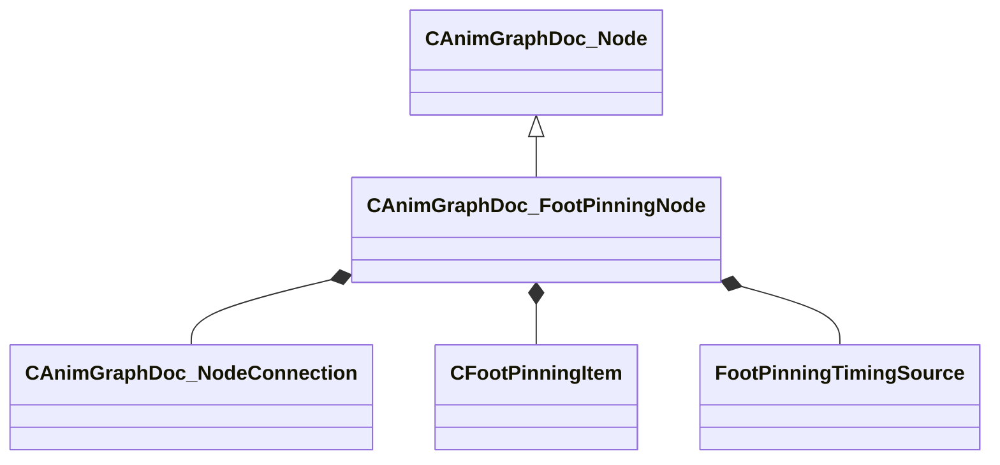

[Schemas](../../schemas.md) / [animgraphdoclib](../animgraphdoclib.md) / CAnimGraphDoc_FootPinningNode

# CAnimGraphDoc_FootPinningNode

> Source: **Build 25000182** · 2026-08-28 · `windows-x86_64` · schema `0.10.0`

**Kind:** class · **Size:** 144 bytes (`0x90`) · **Align:** 8 · **Module:** animgraphdoclib

**Inherits from:** [CAnimGraphDoc_Node](../animgraphdoclib/CAnimGraphDoc_Node.md)

**Metadata:** `MPropertyFriendlyName Foot Pinning`

**Relationships:**

## Memory layout

16 fields (11 declared here, 5 inherited). Offsets are absolute from the object base.

| Offset | Field | Type | From | Annotations |
|--------|-------|------|------|-------------|
| `0x20` | `m_sName` | CUtlString | [CAnimGraphDoc_Node](../animgraphdoclib/CAnimGraphDoc_Node.md) | `MPropertyFriendlyName Name` `MPropertySortPriority 100` |
| `0x28` | `m_vecPosition` | Vector2D | [CAnimGraphDoc_Node](../animgraphdoclib/CAnimGraphDoc_Node.md) | `MPropertyGroupName Debug` `MPropertySortPriority -100` |
| `0x30` | `m_nNodeID` | [AnimNodeID](../modellib/AnimNodeID.md) | [CAnimGraphDoc_Node](../animgraphdoclib/CAnimGraphDoc_Node.md) | `MPropertyGroupName Debug` `MPropertySortPriority -100` |
| `0x34` | `m_bDebugThisNode` | bool | [CAnimGraphDoc_Node](../animgraphdoclib/CAnimGraphDoc_Node.md) | `MPropertyFriendlyName Debug This Node` `MPropertyGroupName Debug` `MPropertySortPriority -100` |
| `0x38` | `m_networkMode` | [AnimNodeNetworkMode](../animgraphlib/AnimNodeNetworkMode.md) | [CAnimGraphDoc_Node](../animgraphdoclib/CAnimGraphDoc_Node.md) | `MPropertyFriendlyName Network Mode` `MPropertySortPriority -110` |
| `0x40` | `m_inputConnection` | [CAnimGraphDoc_NodeConnection](../animgraphdoclib/CAnimGraphDoc_NodeConnection.md) |  | `MPropertySuppressField` |
| `0x48` | `m_items` | CUtlVector< [CFootPinningItem](../animgraphdoclib/CFootPinningItem.md) > |  | `MPropertyAutoExpandSelf` `MPropertyFriendlyName Feet` |
| `0x60` | `m_eTimingSource` | [FootPinningTimingSource](../animgraphlib/FootPinningTimingSource.md) |  | `MPropertyFriendlyName Lock Timing Source` |
| `0x64` | `m_flBlendTime` | float32 |  | `MPropertyFriendlyName Blend Time` |
| `0x68` | `m_flLockBreakDistance` | float32 |  | `MPropertyFriendlyName Lock Break Distance` |
| `0x6c` | `m_flMaxLegStraightAmount` | float32 |  | `MPropertyAttributeRange 0 1` `MPropertyFriendlyName Max Leg Straight Amount` |
| `0x70` | `m_bApplyFootRotationLimits` | bool |  | `MPropertyFriendlyName Limit Foot Rotation` `MPropertyGroupName Foot Rotation Limits` |
| `0x78` | `m_hipBoneName` | CUtlString |  | `MPropertyAttributeChoiceName Bone` `MPropertyFriendlyName Hip Bone` `MPropertyGroupName Foot Rotation Limits` |
| `0x80` | `m_bApplyLegTwistLimits` | bool |  | `MPropertyFriendlyName Limit Leg Twist` `MPropertyGroupName Knee Twist Limits` |
| `0x84` | `m_flMaxLegTwist` | float32 |  | `MPropertyFriendlyName Max Leg Twist Angle` `MPropertyGroupName Knee Twist Limits` |
| `0x88` | `m_bResetChild` | bool |  | `MPropertyFriendlyName Reset Child` |

KV3 class defaults

<pre>{
	&quot;_class&quot;: &quot;CAnimGraphDoc_FootPinningNode&quot;,
	&quot;m_sName&quot;: &quot;Unnamed&quot;,
	&quot;m_vecPosition&quot;:
	[
		0.000000,
		0.000000
	],
	&quot;m_nNodeID&quot;:
	{
		&quot;m_id&quot;: &lt;HIDDEN FOR DIFF&gt;,
	},
	&quot;m_bDebugThisNode&quot;: false,
	&quot;m_networkMode&quot;: &quot;ServerAuthoritative&quot;,
	&quot;m_inputConnection&quot;:
	{
		&quot;m_nodeID&quot;:
		{
			&quot;m_id&quot;: &lt;HIDDEN FOR DIFF&gt;,
		},
		&quot;m_outputID&quot;:
		{
			&quot;m_id&quot;: &lt;HIDDEN FOR DIFF&gt;,
		}
	},
	&quot;m_items&quot;:
	[
	],
	&quot;m_eTimingSource&quot;: &quot;FootMotion&quot;,
	&quot;m_flBlendTime&quot;: 0.200000,
	&quot;m_flLockBreakDistance&quot;: 24.000000,
	&quot;m_flMaxLegStraightAmount&quot;: 0.980000,
	&quot;m_bApplyFootRotationLimits&quot;: false,
	&quot;m_hipBoneName&quot;: &quot;&quot;,
	&quot;m_bApplyLegTwistLimits&quot;: false,
	&quot;m_flMaxLegTwist&quot;: 25.000000,
	&quot;m_bResetChild&quot;: true
}</pre>

