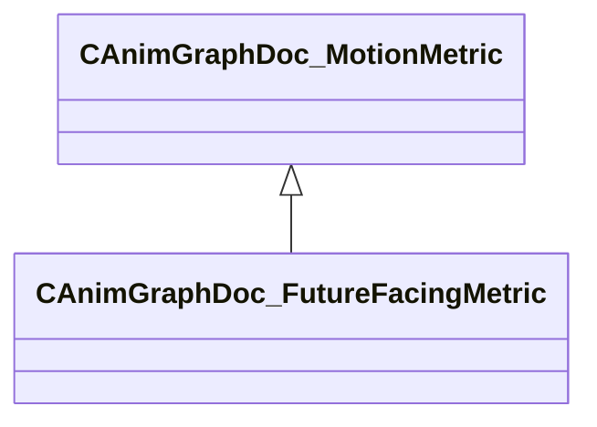

[Schemas](../../schemas.md) / [animgraphdoclib](../animgraphdoclib.md) / CAnimGraphDoc_FutureFacingMetric

# CAnimGraphDoc_FutureFacingMetric

**Kind:** class · **Size:** 48 bytes (`0x30`) · **Align:** 8 · **Module:** animgraphdoclib

**Inherits from:** [CAnimGraphDoc_MotionMetric](../animgraphdoclib/CAnimGraphDoc_MotionMetric.md)

**Metadata:** `MPropertyFriendlyName Future Facing Metric`

**Relationships:**

## Memory layout

3 fields (2 declared here, 1 inherited). Offsets are absolute from the object base.

| Offset | Field | Type | From | Annotations |
|--------|-------|------|------|-------------|
| `0x20` | `m_flWeight` | float32 | [CAnimGraphDoc_MotionMetric](../animgraphdoclib/CAnimGraphDoc_MotionMetric.md) | `MPropertySuppressField` |
| `0x28` | `m_flDistance` | float32 |  | `MPropertyFriendlyName Distance` |
| `0x2c` | `m_flTime` | float32 |  | `MPropertyFriendlyName Time` |

KV3 class defaults

<pre>{
	&quot;_class&quot;: &quot;CAnimGraphDoc_FutureFacingMetric&quot;,
	&quot;m_flWeight&quot;: 1.000000,
	&quot;m_flDistance&quot;: 100.000000,
	&quot;m_flTime&quot;: 1.000000
}</pre>

