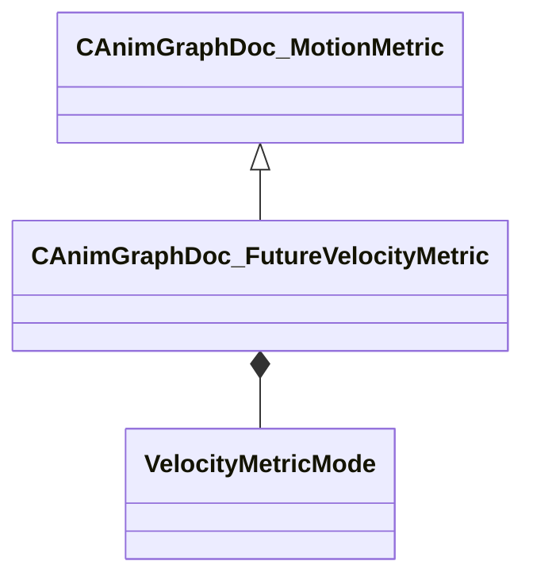

[Schemas](../../schemas.md) / [animgraphdoclib](../animgraphdoclib.md) / CAnimGraphDoc_FutureVelocityMetric

# CAnimGraphDoc_FutureVelocityMetric

**Kind:** class · **Size:** 56 bytes (`0x38`) · **Align:** 8 · **Module:** animgraphdoclib

**Inherits from:** [CAnimGraphDoc_MotionMetric](../animgraphdoclib/CAnimGraphDoc_MotionMetric.md)

**Metadata:** `MPropertyFriendlyName Future Velocity Metric`

**Relationships:**

## Memory layout

6 fields (5 declared here, 1 inherited). Offsets are absolute from the object base.

| Offset | Field | Type | From | Annotations |
|--------|-------|------|------|-------------|
| `0x20` | `m_flWeight` | float32 | [CAnimGraphDoc_MotionMetric](../animgraphdoclib/CAnimGraphDoc_MotionMetric.md) | `MPropertySuppressField` |
| `0x28` | `m_flDistance` | float32 |  | `MPropertyFriendlyName Distance` |
| `0x2c` | `m_flStoppingDistance` | float32 |  | `MPropertyFriendlyName Stopping Distance` |
| `0x30` | `m_eMode` | [VelocityMetricMode](../!GlobalTypes/VelocityMetricMode.md) |  | `MPropertyAutoRebuildOnChange` `MPropertyFriendlyName Mode` |
| `0x31` | `m_bAutoTargetSpeed` | bool |  | `MPropertyAttrStateCallback` `MPropertyAutoRebuildOnChange` `MPropertyFriendlyName Auto-Calculate target speed` |
| `0x34` | `m_flManualTargetSpeed` | float32 |  | `MPropertyAttrStateCallback` `MPropertyFriendlyName Target Speed` |

KV3 class defaults

<pre>{
	&quot;_class&quot;: &quot;CAnimGraphDoc_FutureVelocityMetric&quot;,
	&quot;m_flWeight&quot;: 1.000000,
	&quot;m_flDistance&quot;: 100.000000,
	&quot;m_flStoppingDistance&quot;: 100.000000,
	&quot;m_eMode&quot;: &quot;DirectionAndMagnitude&quot;,
	&quot;m_bAutoTargetSpeed&quot;: true,
	&quot;m_flManualTargetSpeed&quot;: 150.000000
}</pre>

