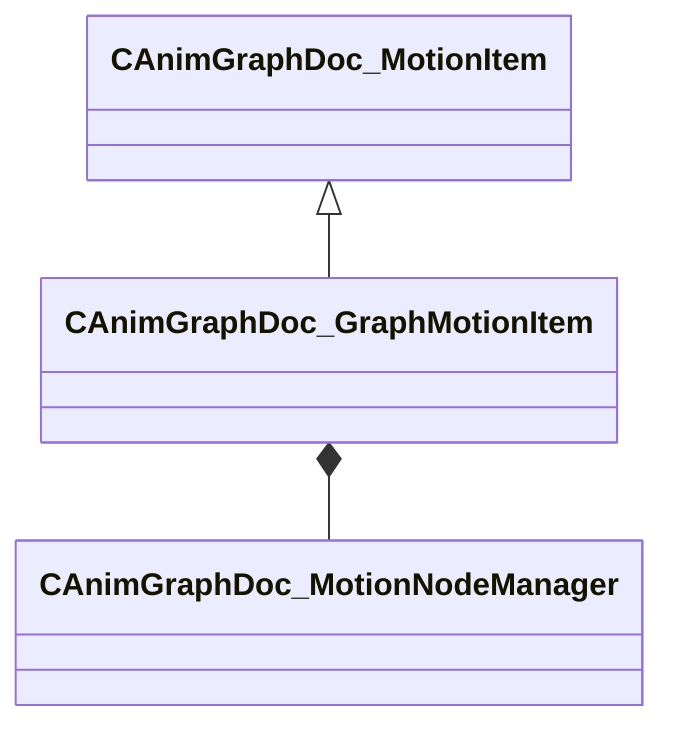

[Schemas](../../schemas.md) / [animgraphdoclib](../animgraphdoclib.md) / CAnimGraphDoc_GraphMotionItem

# CAnimGraphDoc_GraphMotionItem

> Source: **Build 25000182** · 2026-08-28 · `windows-x86_64` · schema `0.10.0`

**Kind:** class · **Size:** 256 bytes (`0x100`) · **Align:** 8 · **Module:** animgraphdoclib

**Inherits from:** [CAnimGraphDoc_MotionItem](../animgraphdoclib/CAnimGraphDoc_MotionItem.md)

**Metadata:** `MPropertyFriendlyName Motion Graph`

**Relationships:**

## Memory layout

7 fields (2 declared here, 5 inherited). Offsets are absolute from the object base.

| Offset | Field | Type | From | Annotations |
|--------|-------|------|------|-------------|
| `0x28` | `m_paramManager` | [CAnimGraphDoc_MotionParameterManager](../animgraphdoclib/CAnimGraphDoc_MotionParameterManager.md) | [CAnimGraphDoc_MotionItem](../animgraphdoclib/CAnimGraphDoc_MotionItem.md) | `MPropertySuppressField` |
| `0x50` | `m_blockSpans` | CUtlVector< CSmartPtr< [CAnimGraphDoc_TagSpan](../animgraphdoclib/CAnimGraphDoc_TagSpan.md) > > | [CAnimGraphDoc_MotionItem](../animgraphdoclib/CAnimGraphDoc_MotionItem.md) | `MPropertySuppressField` |
| `0x68` | `m_tagSpans` | CUtlVector< CSmartPtr< [CAnimGraphDoc_TagSpan](../animgraphdoclib/CAnimGraphDoc_TagSpan.md) > > | [CAnimGraphDoc_MotionItem](../animgraphdoclib/CAnimGraphDoc_MotionItem.md) | `MPropertySuppressField` |
| `0x80` | `m_paramSpans` | CUtlVector< CSmartPtr< [CAnimGraphDoc_ParamSpan](../animgraphdoclib/CAnimGraphDoc_ParamSpan.md) > > | [CAnimGraphDoc_MotionItem](../animgraphdoclib/CAnimGraphDoc_MotionItem.md) | `MPropertySuppressField` |
| `0xa0` | `m_bLoop` | bool | [CAnimGraphDoc_MotionItem](../animgraphdoclib/CAnimGraphDoc_MotionItem.md) | `MPropertyFriendlyName Loop` |
| `0xa8` | `m_name` | CUtlString |  | `MPropertyFriendlyName Name` |
| `0xb0` | `m_nodeManager` | [CAnimGraphDoc_MotionNodeManager](../animgraphdoclib/CAnimGraphDoc_MotionNodeManager.md) |  | `MPropertySuppressField` |

KV3 class defaults

<pre>{
	&quot;_class&quot;: &quot;CAnimGraphDoc_GraphMotionItem&quot;,
	&quot;m_paramManager&quot;:
	{
		&quot;_class&quot;: &quot;CAnimGraphDoc_MotionParameterManager&quot;,
		&quot;m_params&quot;:
		[
		]
	},
	&quot;m_blockSpans&quot;:
	[
	],
	&quot;m_tagSpans&quot;:
	[
	],
	&quot;m_paramSpans&quot;:
	[
	],
	&quot;m_bLoop&quot;: false,
	&quot;m_name&quot;: &quot;New Graph&quot;,
	&quot;m_nodeManager&quot;:
	{
		&quot;_class&quot;: &quot;CAnimGraphDoc_MotionNodeManager&quot;,
		&quot;m_nodes&quot;:
		[
		]
	}
}</pre>

