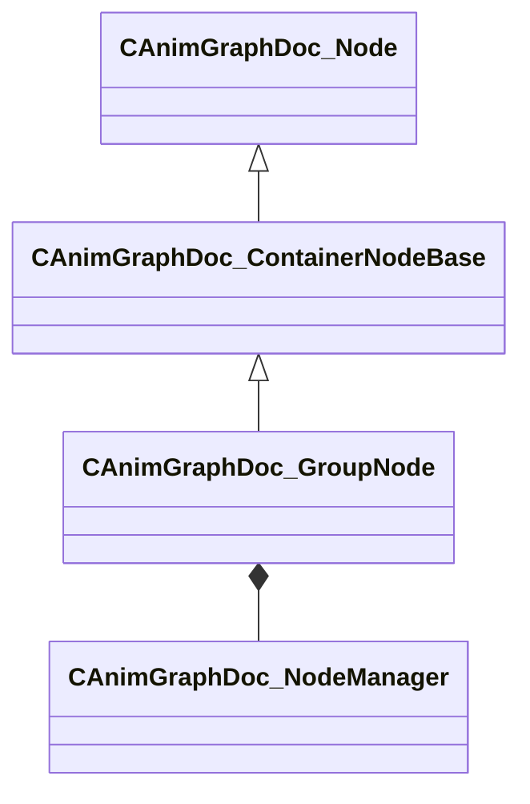

[Schemas](../../schemas.md) / [animgraphdoclib](../animgraphdoclib.md) / CAnimGraphDoc_GroupNode

# CAnimGraphDoc_GroupNode

> Source: **Build 25000182** · 2026-08-28 · `windows-x86_64` · schema `0.10.0`

**Kind:** class · **Size:** 184 bytes (`0xb8`) · **Align:** 8 · **Module:** animgraphdoclib

**Inherits from:** [CAnimGraphDoc_ContainerNodeBase](../animgraphdoclib/CAnimGraphDoc_ContainerNodeBase.md)

**Metadata:** `MPropertyFriendlyName Group`

**Relationships:**

## Memory layout

9 fields (1 declared here, 8 inherited). Offsets are absolute from the object base.

| Offset | Field | Type | From | Annotations |
|--------|-------|------|------|-------------|
| `0x20` | `m_sName` | CUtlString | [CAnimGraphDoc_Node](../animgraphdoclib/CAnimGraphDoc_Node.md) | `MPropertyFriendlyName Name` `MPropertySortPriority 100` |
| `0x28` | `m_vecPosition` | Vector2D | [CAnimGraphDoc_Node](../animgraphdoclib/CAnimGraphDoc_Node.md) | `MPropertyGroupName Debug` `MPropertySortPriority -100` |
| `0x30` | `m_nNodeID` | [AnimNodeID](../modellib/AnimNodeID.md) | [CAnimGraphDoc_Node](../animgraphdoclib/CAnimGraphDoc_Node.md) | `MPropertyGroupName Debug` `MPropertySortPriority -100` |
| `0x34` | `m_bDebugThisNode` | bool | [CAnimGraphDoc_Node](../animgraphdoclib/CAnimGraphDoc_Node.md) | `MPropertyFriendlyName Debug This Node` `MPropertyGroupName Debug` `MPropertySortPriority -100` |
| `0x38` | `m_networkMode` | [AnimNodeNetworkMode](../animgraphlib/AnimNodeNetworkMode.md) | [CAnimGraphDoc_Node](../animgraphdoclib/CAnimGraphDoc_Node.md) | `MPropertyFriendlyName Network Mode` `MPropertySortPriority -110` |
| `0x48` | `m_inputNodeID` | [AnimNodeID](../modellib/AnimNodeID.md) | [CAnimGraphDoc_ContainerNodeBase](../animgraphdoclib/CAnimGraphDoc_ContainerNodeBase.md) | `MPropertySuppressField` |
| `0x4c` | `m_outputNodeID` | [AnimNodeID](../modellib/AnimNodeID.md) | [CAnimGraphDoc_ContainerNodeBase](../animgraphdoclib/CAnimGraphDoc_ContainerNodeBase.md) | `MPropertySuppressField` |
| `0x50` | `m_inputConnectionMap` | CUtlHashtable< [AnimNodeOutputID](../modellib/AnimNodeOutputID.md), [CAnimGraphDoc_NodeConnection](../animgraphdoclib/CAnimGraphDoc_NodeConnection.md) > | [CAnimGraphDoc_ContainerNodeBase](../animgraphdoclib/CAnimGraphDoc_ContainerNodeBase.md) | `MPropertySuppressField` |
| `0x70` | `m_nodeMgr` | [CAnimGraphDoc_NodeManager](../animgraphdoclib/CAnimGraphDoc_NodeManager.md) |  | `MPropertySuppressField` |
