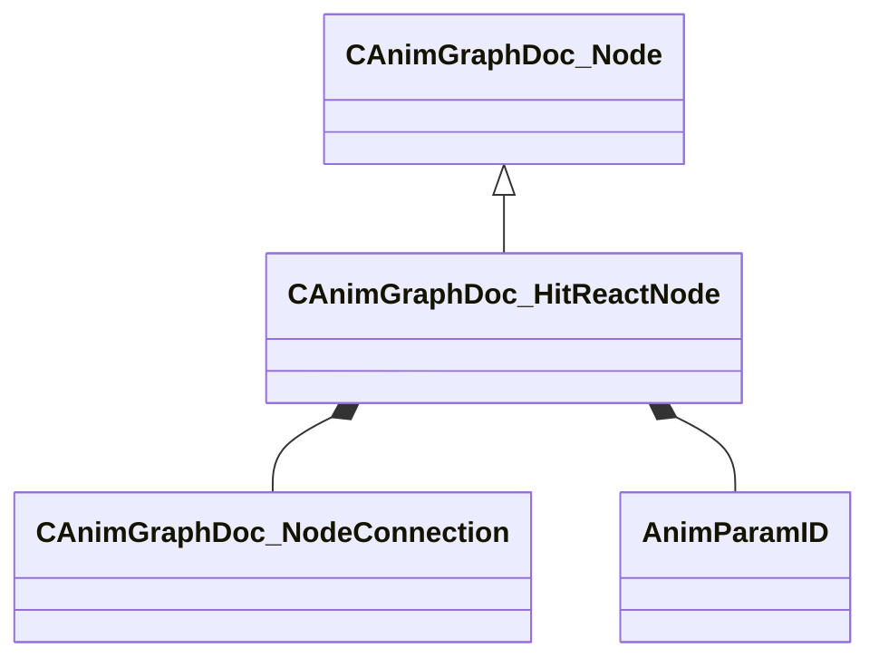

[Schemas](../../schemas.md) / [animgraphdoclib](../animgraphdoclib.md) / CAnimGraphDoc_HitReactNode

# CAnimGraphDoc_HitReactNode

> Source: **Build 25000182** · 2026-08-28 · `windows-x86_64` · schema `0.10.0`

**Kind:** class · **Size:** 224 bytes (`0xe0`) · **Align:** 8 · **Module:** animgraphdoclib

**Inherits from:** [CAnimGraphDoc_Node](../animgraphdoclib/CAnimGraphDoc_Node.md)

**Metadata:** `MPropertyFriendlyName Procedural Hit Reacts`

**Relationships:**

## Memory layout

34 fields (29 declared here, 5 inherited). Offsets are absolute from the object base.

| Offset | Field | Type | From | Annotations |
|--------|-------|------|------|-------------|
| `0x20` | `m_sName` | CUtlString | [CAnimGraphDoc_Node](../animgraphdoclib/CAnimGraphDoc_Node.md) | `MPropertyFriendlyName Name` `MPropertySortPriority 100` |
| `0x28` | `m_vecPosition` | Vector2D | [CAnimGraphDoc_Node](../animgraphdoclib/CAnimGraphDoc_Node.md) | `MPropertyGroupName Debug` `MPropertySortPriority -100` |
| `0x30` | `m_nNodeID` | [AnimNodeID](../modellib/AnimNodeID.md) | [CAnimGraphDoc_Node](../animgraphdoclib/CAnimGraphDoc_Node.md) | `MPropertyGroupName Debug` `MPropertySortPriority -100` |
| `0x34` | `m_bDebugThisNode` | bool | [CAnimGraphDoc_Node](../animgraphdoclib/CAnimGraphDoc_Node.md) | `MPropertyFriendlyName Debug This Node` `MPropertyGroupName Debug` `MPropertySortPriority -100` |
| `0x38` | `m_networkMode` | [AnimNodeNetworkMode](../animgraphlib/AnimNodeNetworkMode.md) | [CAnimGraphDoc_Node](../animgraphdoclib/CAnimGraphDoc_Node.md) | `MPropertyFriendlyName Network Mode` `MPropertySortPriority -110` |
| `0x40` | `m_inputConnection` | [CAnimGraphDoc_NodeConnection](../animgraphdoclib/CAnimGraphDoc_NodeConnection.md) |  | `MPropertySuppressField` |
| `0x48` | `m_flMinDelayBetweenHits` | float32 |  | `MPropertyFriendlyName Minimum Delay Between Hits` |
| `0x50` | `m_triggerParamName` | CUtlString |  | `MPropertySuppressField` |
| `0x58` | `m_hitBoneParamName` | CUtlString |  | `MPropertySuppressField` |
| `0x60` | `m_hitOffsetParamName` | CUtlString |  | `MPropertySuppressField` |
| `0x68` | `m_hitDirectionParamName` | CUtlString |  | `MPropertySuppressField` |
| `0x70` | `m_hitStrengthParamName` | CUtlString |  | `MPropertySuppressField` |
| `0x78` | `m_triggerParam` | [AnimParamID](../modellib/AnimParamID.md) |  | `MPropertyAttributeChoiceName BoolParameter` `MPropertyFriendlyName Trigger Parameter` |
| `0x7c` | `m_hitBoneParam` | [AnimParamID](../modellib/AnimParamID.md) |  | `MPropertyAttributeChoiceName IntParameter` `MPropertyFriendlyName Hit Bone Parameter` |
| `0x80` | `m_hitOffsetParam` | [AnimParamID](../modellib/AnimParamID.md) |  | `MPropertyAttributeChoiceName VectorParameter` `MPropertyFriendlyName Hit Offset Parameter` |
| `0x84` | `m_hitDirectionParam` | [AnimParamID](../modellib/AnimParamID.md) |  | `MPropertyAttributeChoiceName VectorParameter` `MPropertyFriendlyName Hit Direction Parameter` |
| `0x88` | `m_hitStrengthParam` | [AnimParamID](../modellib/AnimParamID.md) |  | `MPropertyAttributeChoiceName FloatParameter` `MPropertyFriendlyName Hit Strength Parameter` |
| `0x90` | `m_weightListName` | CUtlString |  | `MPropertyAttributeChoiceName BoneMask` `MPropertyFriendlyName Bone Weights` |
| `0x98` | `m_hipBoneName` | CUtlString |  | `MPropertyAttributeChoiceName Bone` `MPropertyFriendlyName Hip Bone` |
| `0xa0` | `m_flHipBoneTranslationScale` | float32 |  | `MPropertyFriendlyName Hip Translation Scale` |
| `0xa4` | `m_nEffectedBoneCount` | int32 |  | `MPropertyFriendlyName Number of bone effected` |
| `0xa8` | `m_flMaxImpactForce` | float32 |  | `MPropertyFriendlyName Max Impact Force` |
| `0xac` | `m_flMinImpactForce` | float32 |  | `MPropertyFriendlyName Min Impact Force` |
| `0xb0` | `m_flWhipImpactScale` | float32 |  | `MPropertyFriendlyName Whip Impact Scale` |
| `0xb4` | `m_flCounterRotationScale` | float32 |  | `MPropertyFriendlyName Counter Rotation Scale` |
| `0xb8` | `m_flDistanceFadeScale` | float32 |  | `MPropertyFriendlyName Distance Fade Scale` |
| `0xbc` | `m_flPropagationScale` | float32 |  | `MPropertyFriendlyName Propagation Scale` |
| `0xc0` | `m_flWhipDelay` | float32 |  | `MPropertyFriendlyName Whip Delay Time` |
| `0xc4` | `m_flSpringStrength` | float32 |  | `MPropertyFriendlyName Spring Strength` |
| `0xc8` | `m_flWhipSpringStrength` | float32 |  | `MPropertyFriendlyName Whip Spring Strength` |
| `0xcc` | `m_flHipDipSpringStrength` | float32 |  | `MPropertyFriendlyName Hip Dip Spring Strength` |
| `0xd0` | `m_flHipDipImpactScale` | float32 |  | `MPropertyFriendlyName Hip Dip Scale` |
| `0xd4` | `m_flHipDipDelay` | float32 |  | `MPropertyFriendlyName Hip Dip Delay Time` |
| `0xd8` | `m_bResetBase` | bool |  | `MPropertyFriendlyName Reset Child` |

KV3 class defaults

<pre>{
	&quot;_class&quot;: &quot;CAnimGraphDoc_HitReactNode&quot;,
	&quot;m_sName&quot;: &quot;Unnamed&quot;,
	&quot;m_vecPosition&quot;:
	[
		0.000000,
		0.000000
	],
	&quot;m_nNodeID&quot;:
	{
		&quot;m_id&quot;: &lt;HIDDEN FOR DIFF&gt;,
	},
	&quot;m_bDebugThisNode&quot;: false,
	&quot;m_networkMode&quot;: &quot;ServerAuthoritative&quot;,
	&quot;m_inputConnection&quot;:
	{
		&quot;m_nodeID&quot;:
		{
			&quot;m_id&quot;: &lt;HIDDEN FOR DIFF&gt;,
		},
		&quot;m_outputID&quot;:
		{
			&quot;m_id&quot;: &lt;HIDDEN FOR DIFF&gt;,
		}
	},
	&quot;m_flMinDelayBetweenHits&quot;: 0.000000,
	&quot;m_triggerParamName&quot;: &quot;&quot;,
	&quot;m_hitBoneParamName&quot;: &quot;&quot;,
	&quot;m_hitOffsetParamName&quot;: &quot;&quot;,
	&quot;m_hitDirectionParamName&quot;: &quot;&quot;,
	&quot;m_hitStrengthParamName&quot;: &quot;&quot;,
	&quot;m_triggerParam&quot;:
	{
		&quot;m_id&quot;: &lt;HIDDEN FOR DIFF&gt;,
	},
	&quot;m_hitBoneParam&quot;:
	{
		&quot;m_id&quot;: &lt;HIDDEN FOR DIFF&gt;,
	},
	&quot;m_hitOffsetParam&quot;:
	{
		&quot;m_id&quot;: &lt;HIDDEN FOR DIFF&gt;,
	},
	&quot;m_hitDirectionParam&quot;:
	{
		&quot;m_id&quot;: &lt;HIDDEN FOR DIFF&gt;,
	},
	&quot;m_hitStrengthParam&quot;:
	{
		&quot;m_id&quot;: &lt;HIDDEN FOR DIFF&gt;,
	},
	&quot;m_weightListName&quot;: &quot;&quot;,
	&quot;m_hipBoneName&quot;: &quot;&quot;,
	&quot;m_flHipBoneTranslationScale&quot;: 1.000000,
	&quot;m_nEffectedBoneCount&quot;: 4,
	&quot;m_flMaxImpactForce&quot;: 100.000000,
	&quot;m_flMinImpactForce&quot;: 50.000000,
	&quot;m_flWhipImpactScale&quot;: 1.000000,
	&quot;m_flCounterRotationScale&quot;: 0.500000,
	&quot;m_flDistanceFadeScale&quot;: 1.000000,
	&quot;m_flPropagationScale&quot;: 1.000000,
	&quot;m_flWhipDelay&quot;: 0.050000,
	&quot;m_flSpringStrength&quot;: 15.000000,
	&quot;m_flWhipSpringStrength&quot;: 10.000000,
	&quot;m_flHipDipSpringStrength&quot;: 10.000000,
	&quot;m_flHipDipImpactScale&quot;: 1.000000,
	&quot;m_flHipDipDelay&quot;: 0.050000,
	&quot;m_bResetBase&quot;: true
}</pre>

