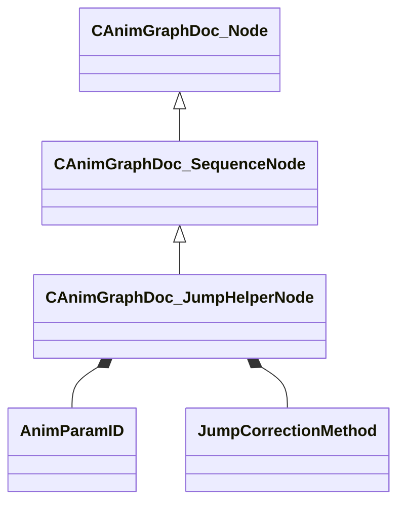

[Schemas](../../schemas.md) / [animgraphdoclib](../animgraphdoclib.md) / CAnimGraphDoc_JumpHelperNode

# CAnimGraphDoc_JumpHelperNode

**Kind:** class · **Size:** 208 bytes (`0xd0`) · **Align:** 8 · **Module:** animgraphdoclib

**Inherits from:** [CAnimGraphDoc_SequenceNode](../animgraphdoclib/CAnimGraphDoc_SequenceNode.md)

**Metadata:** `MPropertyFriendlyName Jump Helper`

**Relationships:**

## Memory layout

19 fields (9 declared here, 10 inherited). Offsets are absolute from the object base.

| Offset | Field | Type | From | Annotations |
|--------|-------|------|------|-------------|
| `0x20` | `m_sName` | CUtlString | [CAnimGraphDoc_Node](../animgraphdoclib/CAnimGraphDoc_Node.md) | `MPropertyFriendlyName Name` `MPropertySortPriority 100` |
| `0x28` | `m_vecPosition` | Vector2D | [CAnimGraphDoc_Node](../animgraphdoclib/CAnimGraphDoc_Node.md) | `MPropertyGroupName Debug` `MPropertySortPriority -100` |
| `0x30` | `m_nNodeID` | [AnimNodeID](../modellib/AnimNodeID.md) | [CAnimGraphDoc_Node](../animgraphdoclib/CAnimGraphDoc_Node.md) | `MPropertyGroupName Debug` `MPropertySortPriority -100` |
| `0x34` | `m_bDebugThisNode` | bool | [CAnimGraphDoc_Node](../animgraphdoclib/CAnimGraphDoc_Node.md) | `MPropertyFriendlyName Debug This Node` `MPropertyGroupName Debug` `MPropertySortPriority -100` |
| `0x38` | `m_networkMode` | [AnimNodeNetworkMode](../!GlobalTypes/AnimNodeNetworkMode.md) | [CAnimGraphDoc_Node](../animgraphdoclib/CAnimGraphDoc_Node.md) | `MPropertyFriendlyName Network Mode` `MPropertySortPriority -110` |
| `0x70` | `m_tagSpans` | CUtlVector< CSmartPtr< [CAnimGraphDoc_TagSpan](../animgraphdoclib/CAnimGraphDoc_TagSpan.md) > > | [CAnimGraphDoc_SequenceNode](../animgraphdoclib/CAnimGraphDoc_SequenceNode.md) | `MPropertySuppressField` |
| `0x88` | `m_paramSpans` | CUtlVector< CSmartPtr< [CAnimGraphDoc_ParamSpan](../animgraphdoclib/CAnimGraphDoc_ParamSpan.md) > > | [CAnimGraphDoc_SequenceNode](../animgraphdoclib/CAnimGraphDoc_SequenceNode.md) | `MPropertySuppressField` |
| `0xa0` | `m_sequenceName` | CUtlString | [CAnimGraphDoc_SequenceNode](../animgraphdoclib/CAnimGraphDoc_SequenceNode.md) | `MPropertyAttributeChoiceName Sequence` `MPropertyFriendlyName Sequence` |
| `0xa8` | `m_playbackSpeed` | float32 | [CAnimGraphDoc_SequenceNode](../animgraphdoclib/CAnimGraphDoc_SequenceNode.md) | `MPropertyFriendlyName Playback Speed` |
| `0xac` | `m_bLoop` | bool | [CAnimGraphDoc_SequenceNode](../animgraphdoclib/CAnimGraphDoc_SequenceNode.md) | `MPropertyFriendlyName Loop` |
| `0xb0` | `m_targetParamName` | CUtlString |  | `MPropertySuppressField` |
| `0xb8` | `m_targetParamID` | [AnimParamID](../modellib/AnimParamID.md) |  | `MPropertyAttributeChoiceName VectorParameter` `MPropertyFriendlyName Target Parameter` |
| `0xbc` | `m_flJumpStartCycle` | float32 |  | `MPropertySuppressField` |
| `0xc0` | `m_flJumpDuration` | float32 |  | `MPropertySuppressField` |
| `0xc4` | `m_bTranslateX` | bool |  | `MPropertyFriendlyName Translate X` |
| `0xc5` | `m_bTranslateY` | bool |  | `MPropertyFriendlyName Translate Y` |
| `0xc6` | `m_bTranslateZ` | bool |  | `MPropertyFriendlyName Translate Z` |
| `0xc7` | `m_bScaleSpeed` | bool |  | `MPropertyFriendlyName Apply Speed Scale` |
| `0xc8` | `m_eCorrectionMethod` | [JumpCorrectionMethod](../!GlobalTypes/JumpCorrectionMethod.md) |  | `MPropertyFriendlyName Correction Method` |

KV3 class defaults

<pre>{
	&quot;_class&quot;: &quot;CAnimGraphDoc_JumpHelperNode&quot;,
	&quot;m_sName&quot;: &quot;Unnamed&quot;,
	&quot;m_vecPosition&quot;:
	[
		0.000000,
		0.000000
	],
	&quot;m_nNodeID&quot;:
	{
		&quot;m_id&quot;: &lt;HIDDEN FOR DIFF&gt;,
	},
	&quot;m_bDebugThisNode&quot;: false,
	&quot;m_networkMode&quot;: &quot;ServerAuthoritative&quot;,
	&quot;m_tagSpans&quot;:
	[
	],
	&quot;m_paramSpans&quot;:
	[
	],
	&quot;m_sequenceName&quot;: &quot;&quot;,
	&quot;m_playbackSpeed&quot;: 1.000000,
	&quot;m_bLoop&quot;: false,
	&quot;m_targetParamName&quot;: &quot;&quot;,
	&quot;m_targetParamID&quot;:
	{
		&quot;m_id&quot;: &lt;HIDDEN FOR DIFF&gt;,
	},
	&quot;m_flJumpStartCycle&quot;: 0.000000,
	&quot;m_flJumpDuration&quot;: 0.100000,
	&quot;m_bTranslateX&quot;: true,
	&quot;m_bTranslateY&quot;: true,
	&quot;m_bTranslateZ&quot;: true,
	&quot;m_bScaleSpeed&quot;: true,
	&quot;m_eCorrectionMethod&quot;: &quot;ScaleMotion&quot;
}</pre>

