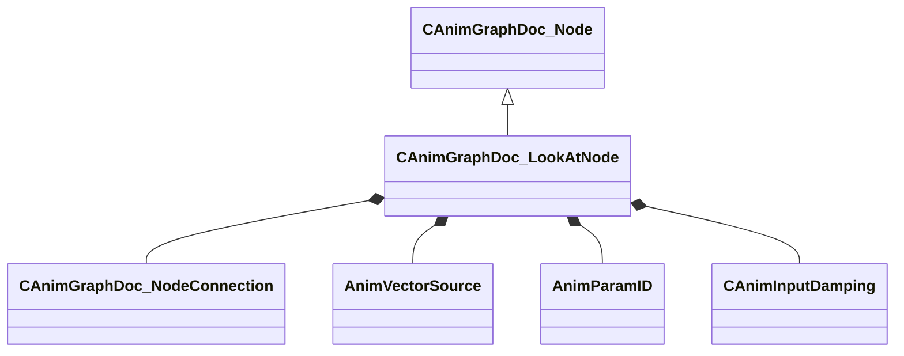

[Schemas](../../schemas.md) / [animgraphdoclib](../animgraphdoclib.md) / CAnimGraphDoc_LookAtNode

# CAnimGraphDoc_LookAtNode

> Source: **Build 25000182** · 2026-08-28 · `windows-x86_64` · schema `0.10.0`

**Kind:** class · **Size:** 176 bytes (`0xb0`) · **Align:** 8 · **Module:** animgraphdoclib

**Inherits from:** [CAnimGraphDoc_Node](../animgraphdoclib/CAnimGraphDoc_Node.md)

**Metadata:** `MPropertyFriendlyName Look At`

**Relationships:**

## Memory layout

24 fields (19 declared here, 5 inherited). Offsets are absolute from the object base.

| Offset | Field | Type | From | Annotations |
|--------|-------|------|------|-------------|
| `0x20` | `m_sName` | CUtlString | [CAnimGraphDoc_Node](../animgraphdoclib/CAnimGraphDoc_Node.md) | `MPropertyFriendlyName Name` `MPropertySortPriority 100` |
| `0x28` | `m_vecPosition` | Vector2D | [CAnimGraphDoc_Node](../animgraphdoclib/CAnimGraphDoc_Node.md) | `MPropertyGroupName Debug` `MPropertySortPriority -100` |
| `0x30` | `m_nNodeID` | [AnimNodeID](../modellib/AnimNodeID.md) | [CAnimGraphDoc_Node](../animgraphdoclib/CAnimGraphDoc_Node.md) | `MPropertyGroupName Debug` `MPropertySortPriority -100` |
| `0x34` | `m_bDebugThisNode` | bool | [CAnimGraphDoc_Node](../animgraphdoclib/CAnimGraphDoc_Node.md) | `MPropertyFriendlyName Debug This Node` `MPropertyGroupName Debug` `MPropertySortPriority -100` |
| `0x38` | `m_networkMode` | [AnimNodeNetworkMode](../animgraphlib/AnimNodeNetworkMode.md) | [CAnimGraphDoc_Node](../animgraphdoclib/CAnimGraphDoc_Node.md) | `MPropertyFriendlyName Network Mode` `MPropertySortPriority -110` |
| `0x40` | `m_inputConnection` | [CAnimGraphDoc_NodeConnection](../animgraphdoclib/CAnimGraphDoc_NodeConnection.md) |  | `MPropertySuppressField` |
| `0x48` | `m_target` | [AnimVectorSource](../animgraphlib/AnimVectorSource.md) |  | `MPropertyAutoRebuildOnChange` `MPropertyFriendlyName Target` |
| `0x50` | `m_paramName` | CUtlString |  | `MPropertySuppressField` |
| `0x58` | `m_param` | [AnimParamID](../modellib/AnimParamID.md) |  | `MPropertyAttrStateCallback` `MPropertyAttributeChoiceName VectorParameter` `MPropertyFriendlyName Target Parameter` |
| `0x5c` | `m_bIsPosition` | bool |  | `MPropertyAttrStateCallback` `MPropertyFriendlyName Parameter is a Position` |
| `0x60` | `m_weightParamName` | CUtlString |  | `MPropertySuppressField` |
| `0x68` | `m_weightParam` | [AnimParamID](../modellib/AnimParamID.md) |  | `MPropertyAttributeChoiceName FloatParameter` `MPropertyFriendlyName Weight Parameter` |
| `0x70` | `m_lookatChainName` | CUtlString |  | `MPropertyAttributeChoiceName LookAtChain` `MPropertyFriendlyName LookAt Chain` |
| `0x78` | `m_attachmentName` | CUtlString |  | `MPropertyAttributeChoiceName Attachment` `MPropertyFriendlyName Aim Attachment` |
| `0x80` | `m_bRotateYawForward` | bool |  | `MPropertyAutoRebuildOnChange` `MPropertyFriendlyName Rotate Through Forward` `MPropertyGroupName Rotation Limits` |
| `0x84` | `m_flYawLimit` | float32 |  | `MPropertyAttrStateCallback` `MPropertyAttributeRange 0 180` `MPropertyFriendlyName Yaw Limit` `MPropertyGroupName Rotation Limits` |
| `0x88` | `m_flPitchLimit` | float32 |  | `MPropertyAttributeRange 0 90` `MPropertyFriendlyName Pitch Limit` `MPropertyGroupName Rotation Limits` |
| `0x8c` | `m_bMaintainUpDirection` | bool |  | `MPropertyFriendlyName Maintain Up Direction` |
| `0x8d` | `m_bResetBase` | bool |  | `MPropertyFriendlyName Reset Child` |
| `0x8e` | `m_bLockWhenWaning` | bool |  | `MPropertyFriendlyName Lock Blend When Waning` |
| `0x8f` | `m_bUseHysteresis` | bool |  | `MPropertyFriendlyName Use Hysteresis` `MPropertyGroupName Hysteresis` |
| `0x90` | `m_flHysteresisInnerAngle` | float32 |  | `MPropertyFriendlyName Inner Angle` `MPropertyGroupName Hysteresis` |
| `0x94` | `m_flHysteresisOuterAngle` | float32 |  | `MPropertyFriendlyName Outer Angle` `MPropertyGroupName Hysteresis` |
| `0x98` | `m_damping` | [CAnimInputDamping](../animgraphlib/CAnimInputDamping.md) |  | `MPropertyFriendlyName Damping` |

KV3 class defaults

<pre>{
	&quot;_class&quot;: &quot;CAnimGraphDoc_LookAtNode&quot;,
	&quot;m_sName&quot;: &quot;Unnamed&quot;,
	&quot;m_vecPosition&quot;:
	[
		0.000000,
		0.000000
	],
	&quot;m_nNodeID&quot;:
	{
		&quot;m_id&quot;: &lt;HIDDEN FOR DIFF&gt;,
	},
	&quot;m_bDebugThisNode&quot;: false,
	&quot;m_networkMode&quot;: &quot;ServerAuthoritative&quot;,
	&quot;m_inputConnection&quot;:
	{
		&quot;m_nodeID&quot;:
		{
			&quot;m_id&quot;: &lt;HIDDEN FOR DIFF&gt;,
		},
		&quot;m_outputID&quot;:
		{
			&quot;m_id&quot;: &lt;HIDDEN FOR DIFF&gt;,
		}
	},
	&quot;m_target&quot;: &quot;VectorParameter&quot;,
	&quot;m_paramName&quot;: &quot;&quot;,
	&quot;m_param&quot;:
	{
		&quot;m_id&quot;: &lt;HIDDEN FOR DIFF&gt;,
	},
	&quot;m_bIsPosition&quot;: false,
	&quot;m_weightParamName&quot;: &quot;&quot;,
	&quot;m_weightParam&quot;:
	{
		&quot;m_id&quot;: &lt;HIDDEN FOR DIFF&gt;,
	},
	&quot;m_lookatChainName&quot;: &quot;&quot;,
	&quot;m_attachmentName&quot;: &quot;&quot;,
	&quot;m_bRotateYawForward&quot;: true,
	&quot;m_flYawLimit&quot;: 45.000000,
	&quot;m_flPitchLimit&quot;: 45.000000,
	&quot;m_bMaintainUpDirection&quot;: false,
	&quot;m_bResetBase&quot;: true,
	&quot;m_bLockWhenWaning&quot;: true,
	&quot;m_bUseHysteresis&quot;: false,
	&quot;m_flHysteresisInnerAngle&quot;: 1.000000,
	&quot;m_flHysteresisOuterAngle&quot;: 20.000000,
	&quot;m_damping&quot;:
	{
		&quot;_class&quot;: &quot;CAnimInputDamping&quot;,
		&quot;m_speedFunction&quot;: &quot;NoDamping&quot;,
		&quot;m_fSpeedScale&quot;: 1.000000,
		&quot;m_fFallingSpeedScale&quot;: 1.000000
	}
}</pre>

