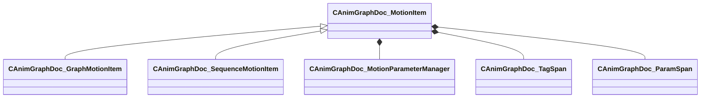

[Schemas](../../schemas.md) / [animgraphdoclib](../animgraphdoclib.md) / CAnimGraphDoc_MotionItem

# CAnimGraphDoc_MotionItem

**Kind:** class · **Size:** 168 bytes (`0xa8`) · **Align:** 255 · **Module:** animgraphdoclib

**Derived by:** [CAnimGraphDoc_GraphMotionItem](../animgraphdoclib/CAnimGraphDoc_GraphMotionItem.md), [CAnimGraphDoc_SequenceMotionItem](../animgraphdoclib/CAnimGraphDoc_SequenceMotionItem.md)

**Relationships:**

## Memory layout

5 fields (5 declared here, 0 inherited). Offsets are absolute from the object base.

| Offset | Field | Type | From | Annotations |
|--------|-------|------|------|-------------|
| `0x28` | `m_paramManager` | [CAnimGraphDoc_MotionParameterManager](../animgraphdoclib/CAnimGraphDoc_MotionParameterManager.md) |  | `MPropertySuppressField` |
| `0x50` | `m_blockSpans` | CUtlVector< CSmartPtr< [CAnimGraphDoc_TagSpan](../animgraphdoclib/CAnimGraphDoc_TagSpan.md) > > |  | `MPropertySuppressField` |
| `0x68` | `m_tagSpans` | CUtlVector< CSmartPtr< [CAnimGraphDoc_TagSpan](../animgraphdoclib/CAnimGraphDoc_TagSpan.md) > > |  | `MPropertySuppressField` |
| `0x80` | `m_paramSpans` | CUtlVector< CSmartPtr< [CAnimGraphDoc_ParamSpan](../animgraphdoclib/CAnimGraphDoc_ParamSpan.md) > > |  | `MPropertySuppressField` |
| `0xa0` | `m_bLoop` | bool |  | `MPropertyFriendlyName Loop` |
