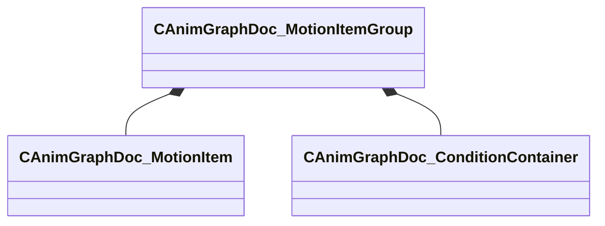

[Schemas](../../schemas.md) / [animgraphdoclib](../animgraphdoclib.md) / CAnimGraphDoc_MotionItemGroup

# CAnimGraphDoc_MotionItemGroup

> Source: **Build 25000182** · 2026-08-28 · `windows-x86_64` · schema `0.10.0`

**Kind:** class · **Size:** 112 bytes (`0x70`) · **Align:** 8 · **Module:** animgraphdoclib

**Metadata:** `MPropertyFriendlyName Motion Clip Group`

**Relationships:**

## Memory layout

3 fields (3 declared here, 0 inherited). Offsets are absolute from the object base.

| Offset | Field | Type | From | Annotations |
|--------|-------|------|------|-------------|
| `0x20` | `m_motions` | CUtlVector< CSmartPtr< [CAnimGraphDoc_MotionItem](../animgraphdoclib/CAnimGraphDoc_MotionItem.md) > > |  | `MPropertySuppressField` |
| `0x38` | `m_name` | CUtlString |  | `MPropertyFriendlyName Name` |
| `0x40` | `m_conditions` | [CAnimGraphDoc_ConditionContainer](../animgraphdoclib/CAnimGraphDoc_ConditionContainer.md) |  |  |

KV3 class defaults

<pre>{
	&quot;_class&quot;: &quot;CAnimGraphDoc_MotionItemGroup&quot;,
	&quot;m_motions&quot;:
	[
	],
	&quot;m_name&quot;: &quot;Unnamed Group&quot;,
	&quot;m_conditions&quot;:
	{
		&quot;_class&quot;: &quot;CAnimGraphDoc_ConditionContainer&quot;,
		&quot;m_conditions&quot;:
		[
		]
	}
}</pre>

