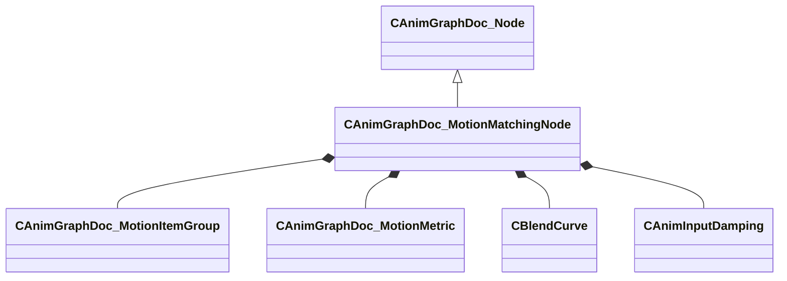

[Schemas](../../schemas.md) / [animgraphdoclib](../animgraphdoclib.md) / CAnimGraphDoc_MotionMatchingNode

# CAnimGraphDoc_MotionMatchingNode

**Kind:** class · **Size:** 216 bytes (`0xd8`) · **Align:** 8 · **Module:** animgraphdoclib

**Inherits from:** [CAnimGraphDoc_Node](../animgraphdoclib/CAnimGraphDoc_Node.md)

**Metadata:** `MPropertyFriendlyName Motion Matching`

**Relationships:**

## Memory layout

28 fields (23 declared here, 5 inherited). Offsets are absolute from the object base.

| Offset | Field | Type | From | Annotations |
|--------|-------|------|------|-------------|
| `0x20` | `m_sName` | CUtlString | [CAnimGraphDoc_Node](../animgraphdoclib/CAnimGraphDoc_Node.md) | `MPropertyFriendlyName Name` `MPropertySortPriority 100` |
| `0x28` | `m_vecPosition` | Vector2D | [CAnimGraphDoc_Node](../animgraphdoclib/CAnimGraphDoc_Node.md) | `MPropertyGroupName Debug` `MPropertySortPriority -100` |
| `0x30` | `m_nNodeID` | [AnimNodeID](../modellib/AnimNodeID.md) | [CAnimGraphDoc_Node](../animgraphdoclib/CAnimGraphDoc_Node.md) | `MPropertyGroupName Debug` `MPropertySortPriority -100` |
| `0x34` | `m_bDebugThisNode` | bool | [CAnimGraphDoc_Node](../animgraphdoclib/CAnimGraphDoc_Node.md) | `MPropertyFriendlyName Debug This Node` `MPropertyGroupName Debug` `MPropertySortPriority -100` |
| `0x38` | `m_networkMode` | [AnimNodeNetworkMode](../animgraphlib/AnimNodeNetworkMode.md) | [CAnimGraphDoc_Node](../animgraphdoclib/CAnimGraphDoc_Node.md) | `MPropertyFriendlyName Network Mode` `MPropertySortPriority -110` |
| `0x48` | `m_groups` | CUtlVector< CSmartPtr< [CAnimGraphDoc_MotionItemGroup](../animgraphdoclib/CAnimGraphDoc_MotionItemGroup.md) > > |  | `MPropertySuppressField` |
| `0x60` | `m_metrics` | CUtlVector< CSmartPtr< [CAnimGraphDoc_MotionMetric](../animgraphdoclib/CAnimGraphDoc_MotionMetric.md) > > |  | `MPropertySuppressField` |
| `0x78` | `m_blendCurve` | [CBlendCurve](../animgraphlib/CBlendCurve.md) |  | `MPropertySuppressField` |
| `0x80` | `m_nRandomSeed` | int32 |  | `MPropertySuppressField` |
| `0x84` | `m_flSampleRate` | float32 |  | `MPropertyAttributeRange 0.01 0.2` `MPropertyFriendlyName Sample Rate` |
| `0x88` | `m_bSearchEveryTick` | bool |  | `MPropertyAutoRebuildOnChange` `MPropertyFriendlyName Search Every Update` `MPropertyGroupName Search Frequency` |
| `0x8c` | `m_flSearchInterval` | float32 |  | `MPropertyAttrStateCallback` `MPropertyFriendlyName Search Interval` `MPropertyGroupName Search Frequency` |
| `0x90` | `m_bSearchWhenMotionEnds` | bool |  | `MPropertyAttrStateCallback` `MPropertyFriendlyName Search when motion ends` `MPropertyGroupName Search Frequency` |
| `0x91` | `m_bSearchWhenGoalChanges` | bool |  | `MPropertyAttrStateCallback` `MPropertyFriendlyName Search when goal changes` `MPropertyGroupName Search Frequency` |
| `0x94` | `m_flBlendTime` | float32 |  | `MPropertyFriendlyName Blend Time` |
| `0x98` | `m_flSelectionThreshold` | float32 |  | `MPropertyFriendlyName Selection Threshold` |
| `0x9c` | `m_flReselectionTimeWindow` | float32 |  | `MPropertyFriendlyName Re-Selection Time Window` |
| `0xa0` | `m_bLockSelectionWhenWaning` | bool |  | `MPropertyFriendlyName Lock Selection When Waning` |
| `0xa1` | `m_bEnableRotationCorrection` | bool |  | `MPropertyFriendlyName Enable Rotation Correction` |
| `0xa2` | `m_bGoalAssist` | bool |  | `MPropertyAutoRebuildOnChange` `MPropertyFriendlyName Enable Goal Assist` `MPropertyGroupName Goal Assist` |
| `0xa4` | `m_flGoalAssistDistance` | float32 |  | `MPropertyAttrStateCallback` `MPropertyFriendlyName Goal Assist Distance` `MPropertyGroupName Goal Assist` |
| `0xa8` | `m_flGoalAssistTolerance` | float32 |  | `MPropertyAttrStateCallback` `MPropertyFriendlyName Goal Assist Tolerance` `MPropertyGroupName Goal Assist` |
| `0xac` | `m_bEnableDistanceScaling` | bool |  | `MPropertyAutoRebuildOnChange` `MPropertyFriendlyName Enable Distance Scaling` `MPropertyGroupName Distance Scaling` |
| `0xb0` | `m_flDistanceScale_OuterRadius` | float32 |  | `MPropertyAttrStateCallback` `MPropertyFriendlyName Outer Stopping Radius` `MPropertyGroupName Distance Scaling` |
| `0xb4` | `m_flDistanceScale_InnerRadius` | float32 |  | `MPropertyAttrStateCallback` `MPropertyFriendlyName Inner Stopping Radius` `MPropertyGroupName Distance Scaling` |
| `0xb8` | `m_flDistanceScale_MaxScale` | float32 |  | `MPropertyAttrStateCallback` `MPropertyFriendlyName Maximum Speed Scale` `MPropertyGroupName Distance Scaling` |
| `0xbc` | `m_flDistanceScale_MinScale` | float32 |  | `MPropertyAttrStateCallback` `MPropertyFriendlyName Minimum Speed Scale` `MPropertyGroupName Distance Scaling` |
| `0xc0` | `m_distanceScale_Damping` | [CAnimInputDamping](../animgraphlib/CAnimInputDamping.md) |  | `MPropertyAttrStateCallback` `MPropertyFriendlyName Damping` `MPropertyGroupName Distance Scaling` |

KV3 class defaults

<pre>{
	&quot;_class&quot;: &quot;CAnimGraphDoc_MotionMatchingNode&quot;,
	&quot;m_sName&quot;: &quot;Unnamed&quot;,
	&quot;m_vecPosition&quot;:
	[
		0.000000,
		0.000000
	],
	&quot;m_nNodeID&quot;:
	{
		&quot;m_id&quot;: &lt;HIDDEN FOR DIFF&gt;,
	},
	&quot;m_bDebugThisNode&quot;: false,
	&quot;m_networkMode&quot;: &quot;ServerAuthoritative&quot;,
	&quot;m_groups&quot;:
	[
	],
	&quot;m_metrics&quot;:
	[
	],
	&quot;m_blendCurve&quot;:
	{
		&quot;m_flControlPoint1&quot;: 0.000000,
		&quot;m_flControlPoint2&quot;: 1.000000
	},
	&quot;m_nRandomSeed&quot;: &lt;HIDDEN FOR DIFF&gt;,
	&quot;m_flSampleRate&quot;: 0.100000,
	&quot;m_bSearchEveryTick&quot;: true,
	&quot;m_flSearchInterval&quot;: 0.100000,
	&quot;m_bSearchWhenMotionEnds&quot;: true,
	&quot;m_bSearchWhenGoalChanges&quot;: true,
	&quot;m_flBlendTime&quot;: 0.300000,
	&quot;m_flSelectionThreshold&quot;: 0.000000,
	&quot;m_flReselectionTimeWindow&quot;: 0.300000,
	&quot;m_bLockSelectionWhenWaning&quot;: false,
	&quot;m_bEnableRotationCorrection&quot;: true,
	&quot;m_bGoalAssist&quot;: true,
	&quot;m_flGoalAssistDistance&quot;: 40.000000,
	&quot;m_flGoalAssistTolerance&quot;: 2.000000,
	&quot;m_bEnableDistanceScaling&quot;: true,
	&quot;m_flDistanceScale_OuterRadius&quot;: 120.000000,
	&quot;m_flDistanceScale_InnerRadius&quot;: 40.000000,
	&quot;m_flDistanceScale_MaxScale&quot;: 1.500000,
	&quot;m_flDistanceScale_MinScale&quot;: 0.500000,
	&quot;m_distanceScale_Damping&quot;:
	{
		&quot;_class&quot;: &quot;CAnimInputDamping&quot;,
		&quot;m_speedFunction&quot;: &quot;NoDamping&quot;,
		&quot;m_fSpeedScale&quot;: 1.000000,
		&quot;m_fFallingSpeedScale&quot;: 1.000000
	}
}</pre>

