[Schemas](../../schemas.md) / [animgraphdoclib](../animgraphdoclib.md) / CAnimGraphDoc_MotionMetric

# CAnimGraphDoc_MotionMetric

> Source: **Build 25000182** · 2026-08-28 · `windows-x86_64` · schema `0.10.0`

**Kind:** class · **Size:** 40 bytes (`0x28`) · **Align:** n/a (unspecified) · **Module:** animgraphdoclib

**Derived by:** [CAnimGraphDoc_BlockSelectionMetric](../animgraphdoclib/CAnimGraphDoc_BlockSelectionMetric.md), [CAnimGraphDoc_BonePositionMetric](../animgraphdoclib/CAnimGraphDoc_BonePositionMetric.md), [CAnimGraphDoc_BoneVelocityMetric](../animgraphdoclib/CAnimGraphDoc_BoneVelocityMetric.md), [CAnimGraphDoc_CurrentRotationVelocityMetric](../animgraphdoclib/CAnimGraphDoc_CurrentRotationVelocityMetric.md), [CAnimGraphDoc_CurrentVelocityMetric](../animgraphdoclib/CAnimGraphDoc_CurrentVelocityMetric.md), [CAnimGraphDoc_DistanceRemainingMetric](../animgraphdoclib/CAnimGraphDoc_DistanceRemainingMetric.md), [CAnimGraphDoc_FootCycleMetric](../animgraphdoclib/CAnimGraphDoc_FootCycleMetric.md), [CAnimGraphDoc_FootPositionMetric](../animgraphdoclib/CAnimGraphDoc_FootPositionMetric.md), [CAnimGraphDoc_FutureFacingMetric](../animgraphdoclib/CAnimGraphDoc_FutureFacingMetric.md), [CAnimGraphDoc_FutureVelocityMetric](../animgraphdoclib/CAnimGraphDoc_FutureVelocityMetric.md), [CAnimGraphDoc_PathMetric](../animgraphdoclib/CAnimGraphDoc_PathMetric.md), [CAnimGraphDoc_StepsRemainingMetric](../animgraphdoclib/CAnimGraphDoc_StepsRemainingMetric.md), [CAnimGraphDoc_TimeRemainingMetric](../animgraphdoclib/CAnimGraphDoc_TimeRemainingMetric.md)

**Relationships:**

```mermaid
classDiagram
    CAnimGraphDoc_MotionMetric <|-- CAnimGraphDoc_BlockSelectionMetric
    CAnimGraphDoc_MotionMetric <|-- CAnimGraphDoc_BonePositionMetric
    CAnimGraphDoc_MotionMetric <|-- CAnimGraphDoc_BoneVelocityMetric
    CAnimGraphDoc_MotionMetric <|-- CAnimGraphDoc_CurrentRotationVelocityMetric
    CAnimGraphDoc_MotionMetric <|-- CAnimGraphDoc_CurrentVelocityMetric
    CAnimGraphDoc_MotionMetric <|-- CAnimGraphDoc_DistanceRemainingMetric
    CAnimGraphDoc_MotionMetric <|-- CAnimGraphDoc_FootCycleMetric
    CAnimGraphDoc_MotionMetric <|-- CAnimGraphDoc_FootPositionMetric
    CAnimGraphDoc_MotionMetric <|-- CAnimGraphDoc_FutureFacingMetric
    CAnimGraphDoc_MotionMetric <|-- CAnimGraphDoc_FutureVelocityMetric
    CAnimGraphDoc_MotionMetric <|-- CAnimGraphDoc_PathMetric
    CAnimGraphDoc_MotionMetric <|-- CAnimGraphDoc_StepsRemainingMetric
    CAnimGraphDoc_MotionMetric <|-- CAnimGraphDoc_TimeRemainingMetric
```

## Memory layout

1 field (1 declared here, 0 inherited). Offsets are absolute from the object base.

| Offset | Field | Type | From | Annotations |
|--------|-------|------|------|-------------|
| `0x20` | `m_flWeight` | float32 |  | `MPropertySuppressField` |
