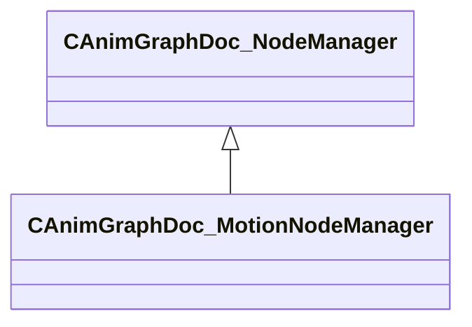

[Schemas](../../schemas.md) / [animgraphdoclib](../animgraphdoclib.md) / CAnimGraphDoc_MotionNodeManager

# CAnimGraphDoc_MotionNodeManager

**Kind:** class · **Size:** 80 bytes (`0x50`) · **Align:** 8 · **Module:** animgraphdoclib

**Inherits from:** [CAnimGraphDoc_NodeManager](../animgraphdoclib/CAnimGraphDoc_NodeManager.md)

**Relationships:**

## Memory layout

1 fields (0 declared here, 1 inherited). Offsets are absolute from the object base.

| Offset | Field | Type | From | Annotations |
|--------|-------|------|------|-------------|
| `0x8` | `m_nodes` | CUtlHashtable< [AnimNodeID](../modellib/AnimNodeID.md), CSmartPtr< [CAnimGraphDoc_Node](../animgraphdoclib/CAnimGraphDoc_Node.md) > > | [CAnimGraphDoc_NodeManager](../animgraphdoclib/CAnimGraphDoc_NodeManager.md) | `MPropertySuppressField` |

KV3 class defaults

<pre>{
	&quot;_class&quot;: &quot;CAnimGraphDoc_MotionNodeManager&quot;,
	&quot;m_nodes&quot;:
	[
	]
}</pre>

