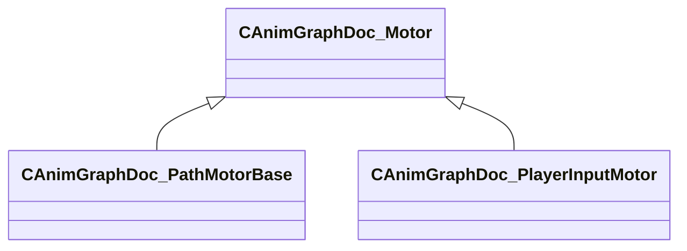

[Schemas](../../schemas.md) / [animgraphdoclib](../animgraphdoclib.md) / CAnimGraphDoc_Motor

# CAnimGraphDoc_Motor

**Kind:** class · **Size:** 48 bytes (`0x30`) · **Align:** 255 · **Module:** animgraphdoclib

**Derived by:** [CAnimGraphDoc_PathMotorBase](../animgraphdoclib/CAnimGraphDoc_PathMotorBase.md), [CAnimGraphDoc_PlayerInputMotor](../animgraphdoclib/CAnimGraphDoc_PlayerInputMotor.md)

**Relationships:**

## Memory layout

2 fields (2 declared here, 0 inherited). Offsets are absolute from the object base.

| Offset | Field | Type | From | Annotations |
|--------|-------|------|------|-------------|
| `0x20` | `m_name` | CUtlString |  | `MPropertyFriendlyName Name` `MPropertySortPriority 100` |
| `0x28` | `m_bDefault` | bool |  | `MPropertyFriendlyName Is Default` |
