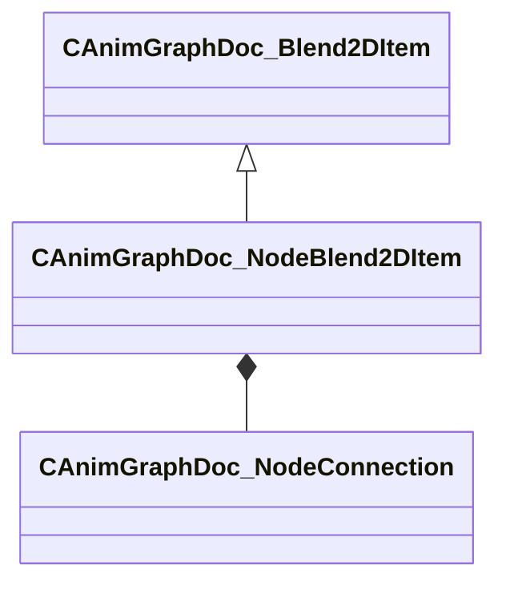

[Schemas](../../schemas.md) / [animgraphdoclib](../animgraphdoclib.md) / CAnimGraphDoc_NodeBlend2DItem

# CAnimGraphDoc_NodeBlend2DItem

> Source: **Build 25000182** · 2026-08-28 · `windows-x86_64` · schema `0.10.0`

**Kind:** class · **Size:** 64 bytes (`0x40`) · **Align:** 8 · **Module:** animgraphdoclib

**Inherits from:** [CAnimGraphDoc_Blend2DItem](../animgraphdoclib/CAnimGraphDoc_Blend2DItem.md)

**Metadata:** `MPropertyFriendlyName Node Blend Item`

**Relationships:**

## Memory layout

5 fields (2 declared here, 3 inherited). Offsets are absolute from the object base.

| Offset | Field | Type | From | Annotations |
|--------|-------|------|------|-------------|
| `0x18` | `m_blendValue` | Vector2D | [CAnimGraphDoc_Blend2DItem](../animgraphdoclib/CAnimGraphDoc_Blend2DItem.md) | `MPropertyFriendlyName Blend Value` |
| `0x28` | `m_bUseCustomDuration` | bool | [CAnimGraphDoc_Blend2DItem](../animgraphdoclib/CAnimGraphDoc_Blend2DItem.md) | `MPropertyAutoRebuildOnChange` `MPropertyFriendlyName Use Custom Duration` `MPropertyGroupName +Duration Override` |
| `0x2c` | `m_flCustomDuration` | float32 | [CAnimGraphDoc_Blend2DItem](../animgraphdoclib/CAnimGraphDoc_Blend2DItem.md) | `MPropertyAttrStateCallback` `MPropertyFriendlyName Custom Duration` `MPropertyGroupName +Duration Override` |
| `0x30` | `m_inputConnection` | [CAnimGraphDoc_NodeConnection](../animgraphdoclib/CAnimGraphDoc_NodeConnection.md) |  | `MPropertySuppressField` |
| `0x38` | `m_name` | CUtlString |  | `MPropertyFriendlyName Name` |

KV3 class defaults

<pre>{
	&quot;_class&quot;: &quot;CAnimGraphDoc_NodeBlend2DItem&quot;,
	&quot;m_blendValue&quot;:
	[
		0.000000,
		0.000000
	],
	&quot;m_bUseCustomDuration&quot;: false,
	&quot;m_flCustomDuration&quot;: 0.000000,
	&quot;m_inputConnection&quot;:
	{
		&quot;m_nodeID&quot;:
		{
			&quot;m_id&quot;: &lt;HIDDEN FOR DIFF&gt;,
		},
		&quot;m_outputID&quot;:
		{
			&quot;m_id&quot;: &lt;HIDDEN FOR DIFF&gt;,
		}
	},
	&quot;m_name&quot;: &quot;&lt;Unnamed Item&gt;&quot;
}</pre>

