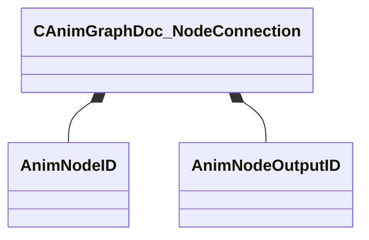

[Schemas](../../schemas.md) / [animgraphdoclib](../animgraphdoclib.md) / CAnimGraphDoc_NodeConnection

# CAnimGraphDoc_NodeConnection

**Kind:** class · **Size:** 8 bytes (`0x8`) · **Align:** 4 · **Module:** animgraphdoclib

**Relationships:**

## Memory layout

2 fields (2 declared here, 0 inherited). Offsets are absolute from the object base.

| Offset | Field | Type | From | Annotations |
|--------|-------|------|------|-------------|
| `0x0` | `m_nodeID` | [AnimNodeID](../modellib/AnimNodeID.md) |  |  |
| `0x4` | `m_outputID` | [AnimNodeOutputID](../modellib/AnimNodeOutputID.md) |  |  |

KV3 class defaults

<pre>{
	&quot;m_nodeID&quot;:
	{
		&quot;m_id&quot;: &lt;HIDDEN FOR DIFF&gt;,
	},
	&quot;m_outputID&quot;:
	{
		&quot;m_id&quot;: &lt;HIDDEN FOR DIFF&gt;,
	}
}</pre>

