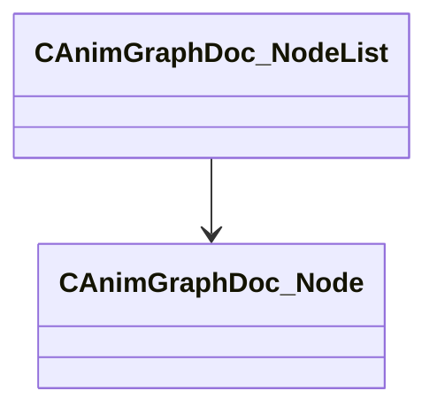

[Schemas](../../schemas.md) / [animgraphdoclib](../animgraphdoclib.md) / CAnimGraphDoc_NodeList

# CAnimGraphDoc_NodeList

**Kind:** class · **Size:** 40 bytes (`0x28`) · **Align:** 8 · **Module:** animgraphdoclib

**Relationships:**

## Memory layout

1 fields (1 declared here, 0 inherited). Offsets are absolute from the object base.

| Offset | Field | Type | From | Annotations |
|--------|-------|------|------|-------------|
| `0x10` | `m_nodes` | CUtlVector< [CAnimGraphDoc_Node](../animgraphdoclib/CAnimGraphDoc_Node.md)* > |  |  |

KV3 class defaults

<pre>{
	&quot;_class&quot;: &quot;CAnimGraphDoc_NodeList&quot;,
	&quot;m_nodes&quot;:
	[
	]
}</pre>

