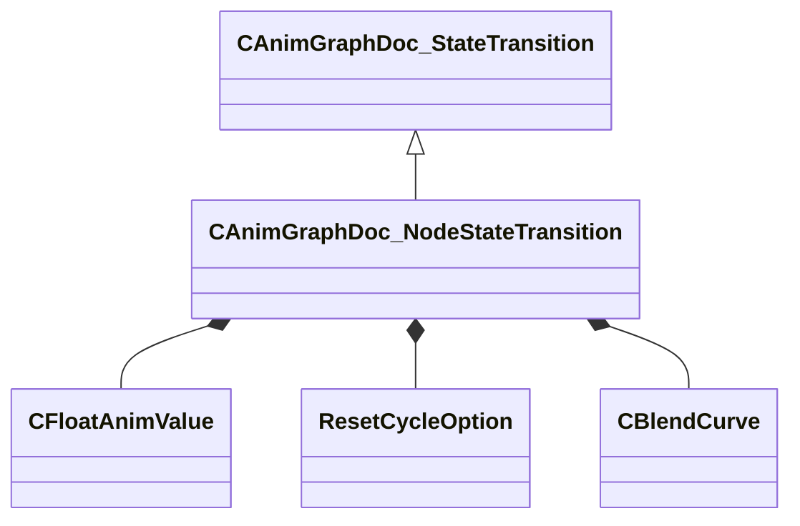

[Schemas](../../schemas.md) / [animgraphdoclib](../animgraphdoclib.md) / CAnimGraphDoc_NodeStateTransition

# CAnimGraphDoc_NodeStateTransition

> Source: **Build 25000182** · 2026-08-28 · `windows-x86_64` · schema `0.10.0`

**Kind:** class · **Size:** 192 bytes (`0xc0`) · **Align:** 8 · **Module:** animgraphdoclib

**Inherits from:** [CAnimGraphDoc_StateTransition](../animgraphdoclib/CAnimGraphDoc_StateTransition.md)

**Relationships:**

## Memory layout

10 fields (5 declared here, 5 inherited). Offsets are absolute from the object base.

| Offset | Field | Type | From | Annotations |
|--------|-------|------|------|-------------|
| `0x28` | `m_conditionList` | [CAnimGraphDoc_ConditionContainer](../animgraphdoclib/CAnimGraphDoc_ConditionContainer.md) | [CAnimGraphDoc_StateTransition](../animgraphdoclib/CAnimGraphDoc_StateTransition.md) | `MPropertySuppressField` |
| `0x58` | `m_srcState` | [AnimStateID](../modellib/AnimStateID.md) | [CAnimGraphDoc_StateTransition](../animgraphdoclib/CAnimGraphDoc_StateTransition.md) | `MPropertySuppressField` |
| `0x5c` | `m_destState` | [AnimStateID](../modellib/AnimStateID.md) | [CAnimGraphDoc_StateTransition](../animgraphdoclib/CAnimGraphDoc_StateTransition.md) | `MPropertySuppressField` |
| `0x60` | `m_sComment` | CUtlString | [CAnimGraphDoc_StateTransition](../animgraphdoclib/CAnimGraphDoc_StateTransition.md) | `MPropertyAttributeEditor TextBlock()` `MPropertyFriendlyName Comment` `MPropertySortPriority -100` |
| `0x68` | `m_bDisabled` | bool | [CAnimGraphDoc_StateTransition](../animgraphdoclib/CAnimGraphDoc_StateTransition.md) | `MPropertyFriendlyName Disable` |
| `0x70` | `m_blendDuration` | [CFloatAnimValue](../animgraphdoclib/CFloatAnimValue.md) |  | `MPropertyFriendlyName Blend Duration` |
| `0x90` | `m_bReset` | bool |  | `MPropertyFriendlyName Reset Destination` |
| `0x94` | `m_resetCycleOption` | [ResetCycleOption](../animgraphlib/ResetCycleOption.md) |  | `MPropertyFriendlyName Start Cycle At` |
| `0x98` | `m_flFixedCycleValue` | [CFloatAnimValue](../animgraphdoclib/CFloatAnimValue.md) |  | `MPropertyFriendlyName Fixed Start Cycle Value` |
| `0xb8` | `m_blendCurve` | [CBlendCurve](../animgraphlib/CBlendCurve.md) |  | `MPropertySuppressField` |

KV3 class defaults

<pre>{
	&quot;_class&quot;: &quot;CAnimGraphDoc_NodeStateTransition&quot;,
	&quot;m_conditionList&quot;:
	{
		&quot;_class&quot;: &quot;CAnimGraphDoc_ConditionContainer&quot;,
		&quot;m_conditions&quot;:
		[
		]
	},
	&quot;m_srcState&quot;:
	{
		&quot;m_id&quot;: &lt;HIDDEN FOR DIFF&gt;,
	},
	&quot;m_destState&quot;:
	{
		&quot;m_id&quot;: &lt;HIDDEN FOR DIFF&gt;,
	},
	&quot;m_sComment&quot;: &quot;&quot;,
	&quot;m_bDisabled&quot;: false,
	&quot;m_blendDuration&quot;:
	{
		&quot;_class&quot;: &quot;CFloatAnimValue&quot;,
		&quot;m_flConstValue&quot;: 0.200000,
		&quot;m_paramName&quot;: &quot;&quot;,
		&quot;m_paramID&quot;:
		{
			&quot;m_id&quot;: &lt;HIDDEN FOR DIFF&gt;,
		},
		&quot;m_eSource&quot;: &quot;Constant&quot;
	},
	&quot;m_bReset&quot;: true,
	&quot;m_resetCycleOption&quot;: &quot;Beginning&quot;,
	&quot;m_flFixedCycleValue&quot;:
	{
		&quot;_class&quot;: &quot;CFloatAnimValue&quot;,
		&quot;m_flConstValue&quot;: 0.000000,
		&quot;m_paramName&quot;: &quot;&quot;,
		&quot;m_paramID&quot;:
		{
			&quot;m_id&quot;: &lt;HIDDEN FOR DIFF&gt;,
		},
		&quot;m_eSource&quot;: &quot;Constant&quot;
	},
	&quot;m_blendCurve&quot;:
	{
		&quot;m_flControlPoint1&quot;: 0.000000,
		&quot;m_flControlPoint2&quot;: 1.000000
	}
}</pre>

