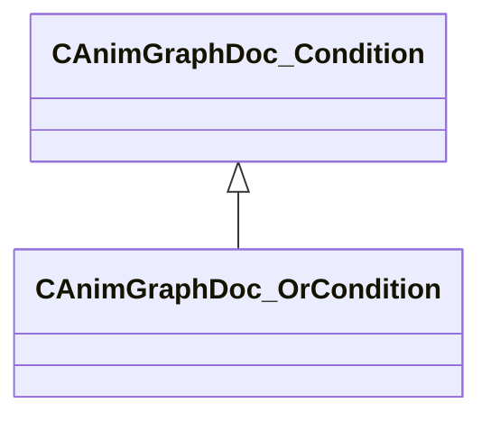

[Schemas](../../schemas.md) / [animgraphdoclib](../animgraphdoclib.md) / CAnimGraphDoc_OrCondition

# CAnimGraphDoc_OrCondition

> Source: **Build 25000182** · 2026-08-28 · `windows-x86_64` · schema `0.10.0`

**Kind:** class · **Size:** 88 bytes (`0x58`) · **Align:** 8 · **Module:** animgraphdoclib

**Inherits from:** [CAnimGraphDoc_Condition](../animgraphdoclib/CAnimGraphDoc_Condition.md), [CAnimGraphDoc_ConditionContainer](../animgraphdoclib/CAnimGraphDoc_ConditionContainer.md)

**Relationships:**

## Memory layout

No schema-visible fields (88 bytes of opaque storage).

**Also inherits (secondary base classes):** [CAnimGraphDoc_ConditionContainer](../animgraphdoclib/CAnimGraphDoc_ConditionContainer.md) — additional-base fields sit at a shifted offset the schema does not record; see each base's own page for its layout.

KV3 class defaults

<pre>{
	&quot;_class&quot;: &quot;CAnimGraphDoc_OrCondition&quot;,
	&quot;m_conditions&quot;:
	[
	]
}</pre>

