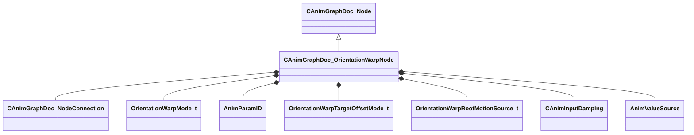

[Schemas](../../schemas.md) / [animgraphdoclib](../animgraphdoclib.md) / CAnimGraphDoc_OrientationWarpNode

# CAnimGraphDoc_OrientationWarpNode

> Source: **Build 25000182** · 2026-08-28 · `windows-x86_64` · schema `0.10.0`

**Kind:** class · **Size:** 152 bytes (`0x98`) · **Align:** 8 · **Module:** animgraphdoclib

**Inherits from:** [CAnimGraphDoc_Node](../animgraphdoclib/CAnimGraphDoc_Node.md)

**Metadata:** `MPropertyFriendlyName Orientation Warp`

**Relationships:**

## Memory layout

19 fields (14 declared here, 5 inherited). Offsets are absolute from the object base.

| Offset | Field | Type | From | Annotations |
|--------|-------|------|------|-------------|
| `0x20` | `m_sName` | CUtlString | [CAnimGraphDoc_Node](../animgraphdoclib/CAnimGraphDoc_Node.md) | `MPropertyFriendlyName Name` `MPropertySortPriority 100` |
| `0x28` | `m_vecPosition` | Vector2D | [CAnimGraphDoc_Node](../animgraphdoclib/CAnimGraphDoc_Node.md) | `MPropertyGroupName Debug` `MPropertySortPriority -100` |
| `0x30` | `m_nNodeID` | [AnimNodeID](../modellib/AnimNodeID.md) | [CAnimGraphDoc_Node](../animgraphdoclib/CAnimGraphDoc_Node.md) | `MPropertyGroupName Debug` `MPropertySortPriority -100` |
| `0x34` | `m_bDebugThisNode` | bool | [CAnimGraphDoc_Node](../animgraphdoclib/CAnimGraphDoc_Node.md) | `MPropertyFriendlyName Debug This Node` `MPropertyGroupName Debug` `MPropertySortPriority -100` |
| `0x38` | `m_networkMode` | [AnimNodeNetworkMode](../animgraphlib/AnimNodeNetworkMode.md) | [CAnimGraphDoc_Node](../animgraphdoclib/CAnimGraphDoc_Node.md) | `MPropertyFriendlyName Network Mode` `MPropertySortPriority -110` |
| `0x40` | `m_inputConnection` | [CAnimGraphDoc_NodeConnection](../animgraphdoclib/CAnimGraphDoc_NodeConnection.md) |  | `MPropertySuppressField` |
| `0x48` | `m_eMode` | [OrientationWarpMode_t](../animgraphlib/OrientationWarpMode_t.md) |  | `MPropertyAutoRebuildOnChange` `MPropertyFriendlyName Orient To` |
| `0x4c` | `m_targetParamID` | [AnimParamID](../modellib/AnimParamID.md) |  | `MPropertyAttrStateCallback` `MPropertyAttributeChoiceName FloatParameter` `MPropertyFriendlyName Angle Parameter` |
| `0x50` | `m_targetPositionParamID` | [AnimParamID](../modellib/AnimParamID.md) |  | `MPropertyAttrStateCallback` `MPropertyAttributeChoiceName VectorParameter` `MPropertyFriendlyName World Position` |
| `0x54` | `m_fallbackTargetPositionParamID` | [AnimParamID](../modellib/AnimParamID.md) |  | `MPropertyAttrStateCallback` `MPropertyAttributeChoiceName VectorParameter` `MPropertyFriendlyName Fallback World Position` |
| `0x58` | `m_eTargetOffsetMode` | [OrientationWarpTargetOffsetMode_t](../animgraphlib/OrientationWarpTargetOffsetMode_t.md) |  | `MPropertyAutoRebuildOnChange` `MPropertyFriendlyName Offset Mode` |
| `0x5c` | `m_flTargetOffset` | float32 |  | `MPropertyAttrStateCallback` `MPropertyFriendlyName Offset` |
| `0x60` | `m_targetOffsetParamID` | [AnimParamID](../modellib/AnimParamID.md) |  | `MPropertyAttrStateCallback` `MPropertyAttributeChoiceName FloatParameter` `MPropertyFriendlyName Offset Parameter` |
| `0x64` | `m_flMaxRootMotionScale` | float32 |  | `MPropertyFriendlyName Max Root Motion Scale` |
| `0x68` | `m_eRootMotionSource` | [OrientationWarpRootMotionSource_t](../animgraphlib/OrientationWarpRootMotionSource_t.md) |  | `MPropertyFriendlyName Root Motion Source` |
| `0x70` | `m_damping` | [CAnimInputDamping](../animgraphlib/CAnimInputDamping.md) |  | `MPropertyAttrStateCallback` `MPropertyFriendlyName Damping` |
| `0x88` | `m_bEnablePreferredRotationDirection` | bool |  | `MPropertyAutoRebuildOnChange` `MPropertyDescription Normally the orientation warp will take the shortest arc to align entity's forward vector with the target. With this option enabled it will rotate in the direction that includes passing through the preferred rotation direction parameter unless the resulting rotion is larger than the threshold specified.` `MPropertyFriendlyName Enable Preferred Rotation Direction` |
| `0x8c` | `m_ePreferredRotationDirection` | [AnimValueSource](../animgraphlib/AnimValueSource.md) |  | `MPropertyAttrStateCallback` `MPropertyDescription An angle relative to the entity's forward. ( Facing Heading, Look Heading ... )` `MPropertyFriendlyName Preferred Rotation Direction` |
| `0x90` | `m_flPreferredRotationThreshold` | float32 |  | `MPropertyAttrStateCallback` `MPropertyDescription Orientation warp will never rotate angle larger than this even if it means not passing through the preferred rotation direction` `MPropertyFriendlyName Preferred Rotation Threshold` |

KV3 class defaults

<pre>{
	&quot;_class&quot;: &quot;CAnimGraphDoc_OrientationWarpNode&quot;,
	&quot;m_sName&quot;: &quot;Unnamed&quot;,
	&quot;m_vecPosition&quot;:
	[
		0.000000,
		0.000000
	],
	&quot;m_nNodeID&quot;:
	{
		&quot;m_id&quot;: &lt;HIDDEN FOR DIFF&gt;,
	},
	&quot;m_bDebugThisNode&quot;: false,
	&quot;m_networkMode&quot;: &quot;ServerAuthoritative&quot;,
	&quot;m_inputConnection&quot;:
	{
		&quot;m_nodeID&quot;:
		{
			&quot;m_id&quot;: &lt;HIDDEN FOR DIFF&gt;,
		},
		&quot;m_outputID&quot;:
		{
			&quot;m_id&quot;: &lt;HIDDEN FOR DIFF&gt;,
		}
	},
	&quot;m_eMode&quot;: &quot;eAngle&quot;,
	&quot;m_targetParamID&quot;:
	{
		&quot;m_id&quot;: &lt;HIDDEN FOR DIFF&gt;,
	},
	&quot;m_targetPositionParamID&quot;:
	{
		&quot;m_id&quot;: &lt;HIDDEN FOR DIFF&gt;,
	},
	&quot;m_fallbackTargetPositionParamID&quot;:
	{
		&quot;m_id&quot;: &lt;HIDDEN FOR DIFF&gt;,
	},
	&quot;m_eTargetOffsetMode&quot;: &quot;eLiteralValue&quot;,
	&quot;m_flTargetOffset&quot;: 0.000000,
	&quot;m_targetOffsetParamID&quot;:
	{
		&quot;m_id&quot;: &lt;HIDDEN FOR DIFF&gt;,
	},
	&quot;m_flMaxRootMotionScale&quot;: 10.000000,
	&quot;m_eRootMotionSource&quot;: &quot;eAnimationOrProcedural&quot;,
	&quot;m_damping&quot;:
	{
		&quot;_class&quot;: &quot;CAnimInputDamping&quot;,
		&quot;m_speedFunction&quot;: &quot;NoDamping&quot;,
		&quot;m_fSpeedScale&quot;: 1.000000,
		&quot;m_fFallingSpeedScale&quot;: 1.000000
	},
	&quot;m_bEnablePreferredRotationDirection&quot;: false,
	&quot;m_ePreferredRotationDirection&quot;: &quot;FacingHeading&quot;,
	&quot;m_flPreferredRotationThreshold&quot;: 190.000000
}</pre>

