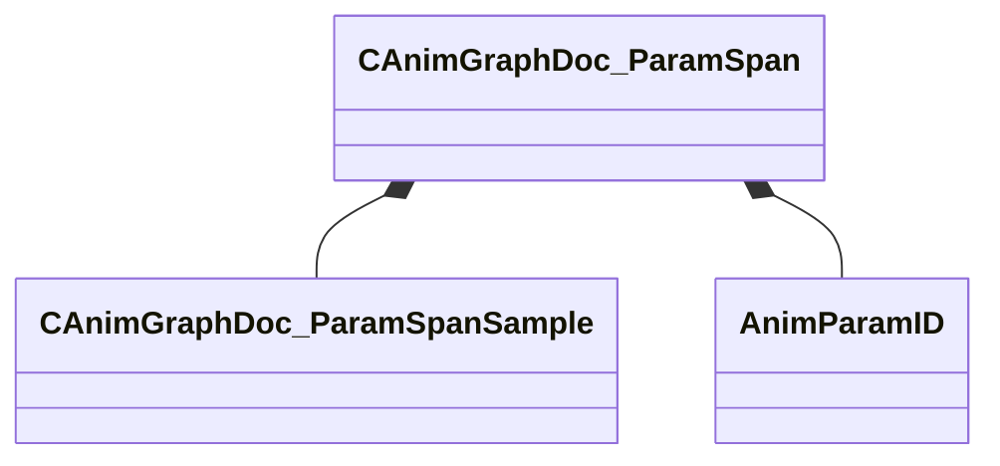

[Schemas](../../schemas.md) / [animgraphdoclib](../animgraphdoclib.md) / CAnimGraphDoc_ParamSpan

# CAnimGraphDoc_ParamSpan

> Source: **Build 25000182** · 2026-08-28 · `windows-x86_64` · schema `0.10.0`

**Kind:** class · **Size:** 80 bytes (`0x50`) · **Align:** 8 · **Module:** animgraphdoclib

**Relationships:**

## Memory layout

5 fields (5 declared here, 0 inherited). Offsets are absolute from the object base.

| Offset | Field | Type | From | Annotations |
|--------|-------|------|------|-------------|
| `0x20` | `m_samples` | CUtlVector< [CAnimGraphDoc_ParamSpanSample](../animgraphdoclib/CAnimGraphDoc_ParamSpanSample.md) > |  |  |
| `0x38` | `m_paramName` | CUtlString |  | `MPropertyHideField` |
| `0x40` | `m_id` | [AnimParamID](../modellib/AnimParamID.md) |  |  |
| `0x44` | `m_flStartCycle` | float32 |  |  |
| `0x48` | `m_flEndCycle` | float32 |  |  |

KV3 class defaults

<pre>{
	&quot;_class&quot;: &quot;CAnimGraphDoc_ParamSpan&quot;,
	&quot;m_samples&quot;:
	[
	],
	&quot;m_paramName&quot;: &quot;&quot;,
	&quot;m_id&quot;:
	{
		&quot;m_id&quot;: &lt;HIDDEN FOR DIFF&gt;,
	},
	&quot;m_flStartCycle&quot;: 0.000000,
	&quot;m_flEndCycle&quot;: 1.000000
}</pre>

