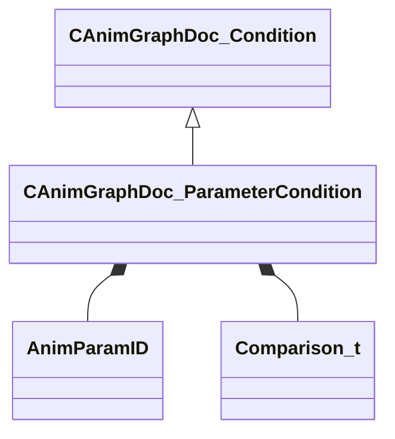

[Schemas](../../schemas.md) / [animgraphdoclib](../animgraphdoclib.md) / CAnimGraphDoc_ParameterCondition

# CAnimGraphDoc_ParameterCondition

**Kind:** class · **Size:** 88 bytes (`0x58`) · **Align:** 8 · **Module:** animgraphdoclib

**Inherits from:** [CAnimGraphDoc_Condition](../animgraphdoclib/CAnimGraphDoc_Condition.md)

**Metadata:** `MPropertyFriendlyName Parameter Condition`

**Relationships:**

## Memory layout

5 fields (5 declared here, 0 inherited). Offsets are absolute from the object base.

| Offset | Field | Type | From | Annotations |
|--------|-------|------|------|-------------|
| `0x28` | `m_paramName` | CUtlString |  |  |
| `0x30` | `m_paramID` | [AnimParamID](../modellib/AnimParamID.md) |  |  |
| `0x34` | `m_comparisonOp` | [Comparison_t](../animgraphdoclib/Comparison_t.md) |  |  |
| `0x38` | `m_comparisonValue` | CAnimVariant |  |  |
| `0x50` | `m_comparisonString` | CUtlString |  |  |

KV3 class defaults

<pre>{
	&quot;_class&quot;: &quot;CAnimGraphDoc_ParameterCondition&quot;,
	&quot;m_paramName&quot;: &quot;&quot;,
	&quot;m_paramID&quot;:
	{
		&quot;m_id&quot;: &lt;HIDDEN FOR DIFF&gt;,
	},
	&quot;m_comparisonOp&quot;: &quot;COMPARISON_EQUALS&quot;,
	&quot;m_comparisonValue&quot;:
	{
		&quot;m_nType&quot;: 0
	},
	&quot;m_comparisonString&quot;: &quot;&quot;
}</pre>

