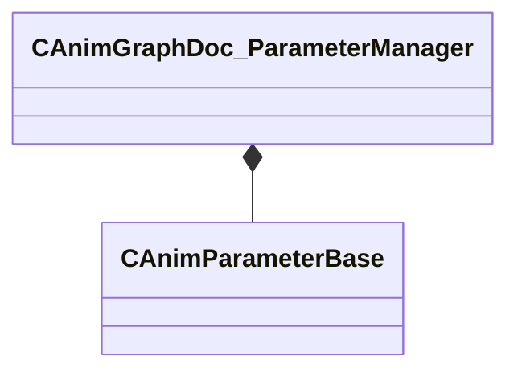

[Schemas](../../schemas.md) / [animgraphdoclib](../animgraphdoclib.md) / CAnimGraphDoc_ParameterManager

# CAnimGraphDoc_ParameterManager

**Kind:** class · **Size:** 96 bytes (`0x60`) · **Align:** 8 · **Module:** animgraphdoclib

**Relationships:**

## Memory layout

1 fields (1 declared here, 0 inherited). Offsets are absolute from the object base.

| Offset | Field | Type | From | Annotations |
|--------|-------|------|------|-------------|
| `0x20` | `m_Parameters` | CUtlVector< CSmartPtr< [CAnimParameterBase](../animgraphlib/CAnimParameterBase.md) > > |  |  |

KV3 class defaults

<pre>{
	&quot;_class&quot;: &quot;CAnimGraphDoc_ParameterManager&quot;,
	&quot;m_Parameters&quot;:
	[
	]
}</pre>

