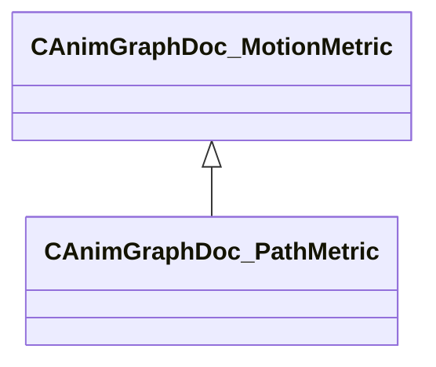

[Schemas](../../schemas.md) / [animgraphdoclib](../animgraphdoclib.md) / CAnimGraphDoc_PathMetric

# CAnimGraphDoc_PathMetric

> Source: **Build 25000182** · 2026-08-28 · `windows-x86_64` · schema `0.10.0`

**Kind:** class · **Size:** 80 bytes (`0x50`) · **Align:** 8 · **Module:** animgraphdoclib

**Inherits from:** [CAnimGraphDoc_MotionMetric](../animgraphdoclib/CAnimGraphDoc_MotionMetric.md)

**Metadata:** `MPropertyFriendlyName Path Metric`

**Relationships:**

## Memory layout

5 fields (4 declared here, 1 inherited). Offsets are absolute from the object base.

| Offset | Field | Type | From | Annotations |
|--------|-------|------|------|-------------|
| `0x20` | `m_flWeight` | float32 | [CAnimGraphDoc_MotionMetric](../animgraphdoclib/CAnimGraphDoc_MotionMetric.md) | `MPropertySuppressField` |
| `0x28` | `m_flDistance` | float32 |  | `MPropertyFriendlyName Distance` |
| `0x30` | `m_pathSamples` | CUtlVector< float32 > |  | `MPropertyFriendlyName Samples Times` |
| `0x48` | `m_bExtrapolateMovement` | bool |  | `MPropertyAutoRebuildOnChange` `MPropertyFriendlyName Extrapolate Movement` |
| `0x4c` | `m_flMinExtrapolationSpeed` | float32 |  | `MPropertyAttrStateCallback` `MPropertyFriendlyName Min Extrapolation Speed` |

KV3 class defaults

<pre>{
	&quot;_class&quot;: &quot;CAnimGraphDoc_PathMetric&quot;,
	&quot;m_flWeight&quot;: 1.000000,
	&quot;m_flDistance&quot;: 100.000000,
	&quot;m_pathSamples&quot;:
	[
	],
	&quot;m_bExtrapolateMovement&quot;: true,
	&quot;m_flMinExtrapolationSpeed&quot;: 2.000000
}</pre>

