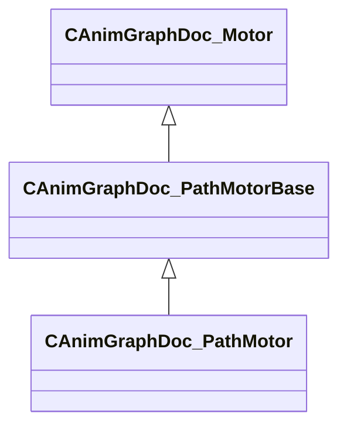

[Schemas](../../schemas.md) / [animgraphdoclib](../animgraphdoclib.md) / CAnimGraphDoc_PathMotor

# CAnimGraphDoc_PathMotor

**Kind:** class · **Size:** 56 bytes (`0x38`) · **Align:** 8 · **Module:** animgraphdoclib

**Inherits from:** [CAnimGraphDoc_PathMotorBase](../animgraphdoclib/CAnimGraphDoc_PathMotorBase.md)

**Metadata:** `MPropertyFriendlyName Path Motor`

**Relationships:**

## Memory layout

3 fields (0 declared here, 3 inherited). Offsets are absolute from the object base.

| Offset | Field | Type | From | Annotations |
|--------|-------|------|------|-------------|
| `0x20` | `m_name` | CUtlString | [CAnimGraphDoc_Motor](../animgraphdoclib/CAnimGraphDoc_Motor.md) | `MPropertyFriendlyName Name` `MPropertySortPriority 100` |
| `0x28` | `m_bDefault` | bool | [CAnimGraphDoc_Motor](../animgraphdoclib/CAnimGraphDoc_Motor.md) | `MPropertyFriendlyName Is Default` |
| `0x30` | `m_bLockToPath` | bool | [CAnimGraphDoc_PathMotorBase](../animgraphdoclib/CAnimGraphDoc_PathMotorBase.md) | `MPropertyFriendlyName Lock To Path` `MPropertySortPriority 90` |

KV3 class defaults

<pre>{
	&quot;_class&quot;: &quot;CAnimGraphDoc_PathMotor&quot;,
	&quot;m_name&quot;: &quot;Unnamed Motor&quot;,
	&quot;m_bDefault&quot;: false,
	&quot;m_bLockToPath&quot;: true
}</pre>

