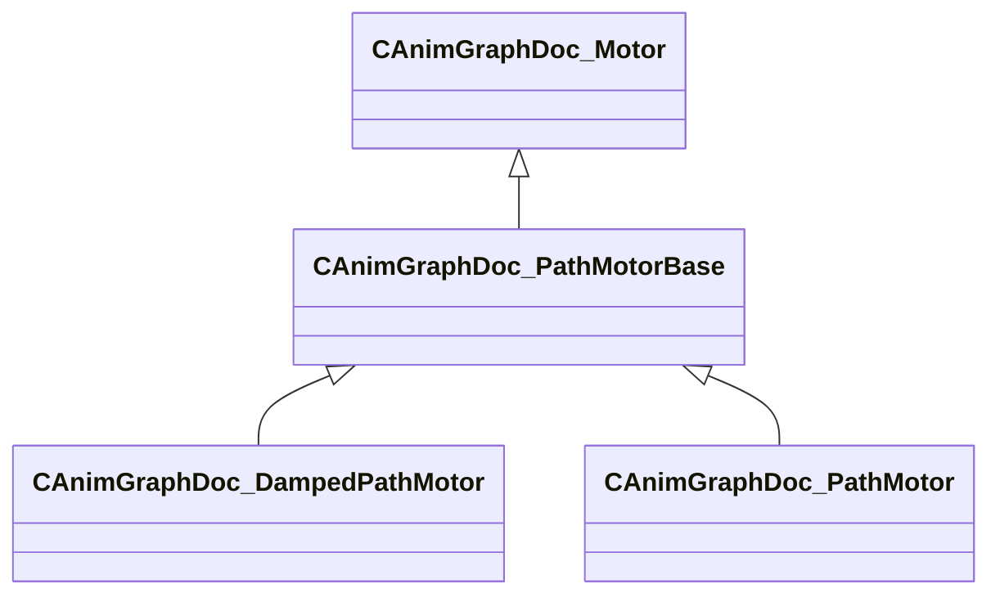

[Schemas](../../schemas.md) / [animgraphdoclib](../animgraphdoclib.md) / CAnimGraphDoc_PathMotorBase

# CAnimGraphDoc_PathMotorBase

> Source: **Build 25000182** · 2026-08-28 · `windows-x86_64` · schema `0.10.0`

**Kind:** class · **Size:** 56 bytes (`0x38`) · **Align:** n/a (unspecified) · **Module:** animgraphdoclib

**Inherits from:** [CAnimGraphDoc_Motor](../animgraphdoclib/CAnimGraphDoc_Motor.md)

**Derived by:** [CAnimGraphDoc_DampedPathMotor](../animgraphdoclib/CAnimGraphDoc_DampedPathMotor.md), [CAnimGraphDoc_PathMotor](../animgraphdoclib/CAnimGraphDoc_PathMotor.md)

**Relationships:**

## Memory layout

3 fields (1 declared here, 2 inherited). Offsets are absolute from the object base.

| Offset | Field | Type | From | Annotations |
|--------|-------|------|------|-------------|
| `0x20` | `m_name` | CUtlString | [CAnimGraphDoc_Motor](../animgraphdoclib/CAnimGraphDoc_Motor.md) | `MPropertyFriendlyName Name` `MPropertySortPriority 100` |
| `0x28` | `m_bDefault` | bool | [CAnimGraphDoc_Motor](../animgraphdoclib/CAnimGraphDoc_Motor.md) | `MPropertyFriendlyName Is Default` |
| `0x30` | `m_bLockToPath` | bool |  | `MPropertyFriendlyName Lock To Path` `MPropertySortPriority 90` |
