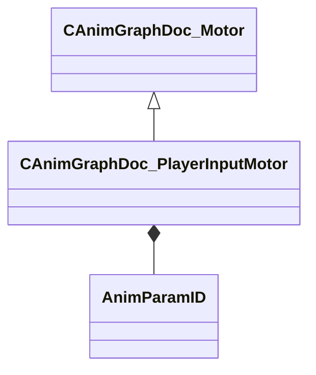

[Schemas](../../schemas.md) / [animgraphdoclib](../animgraphdoclib.md) / CAnimGraphDoc_PlayerInputMotor

# CAnimGraphDoc_PlayerInputMotor

> Source: **Build 25000182** · 2026-08-28 · `windows-x86_64` · schema `0.10.0`

**Kind:** class · **Size:** 120 bytes (`0x78`) · **Align:** 8 · **Module:** animgraphdoclib

**Inherits from:** [CAnimGraphDoc_Motor](../animgraphdoclib/CAnimGraphDoc_Motor.md)

**Metadata:** `MPropertyFriendlyName Player Input Motor`

**Relationships:**

## Memory layout

10 fields (8 declared here, 2 inherited). Offsets are absolute from the object base.

| Offset | Field | Type | From | Annotations |
|--------|-------|------|------|-------------|
| `0x20` | `m_name` | CUtlString | [CAnimGraphDoc_Motor](../animgraphdoclib/CAnimGraphDoc_Motor.md) | `MPropertyFriendlyName Name` `MPropertySortPriority 100` |
| `0x28` | `m_bDefault` | bool | [CAnimGraphDoc_Motor](../animgraphdoclib/CAnimGraphDoc_Motor.md) | `MPropertyFriendlyName Is Default` |
| `0x30` | `m_sampleTimes` | CUtlVector< float32 > |  | `MPropertyFriendlyName Sample Times` |
| `0x48` | `m_bUseAcceleration` | bool |  | `MPropertyFriendlyName Use Acceleration` |
| `0x4c` | `m_flSpringConstant` | float32 |  | `MPropertyFriendlyName Spring Constant` |
| `0x50` | `m_flAnticipationDistance` | float32 |  | `MPropertyFriendlyName Anticipation Distance` |
| `0x58` | `m_anticipationPosParamName` | CUtlString |  | `MPropertySuppressField` |
| `0x60` | `m_anticipationPosParam` | [AnimParamID](../modellib/AnimParamID.md) |  | `MPropertyAttributeChoiceName VectorParameter` `MPropertyFriendlyName Anticipation Position Parameter` |
| `0x68` | `m_anticipationHeadingParamName` | CUtlString |  | `MPropertySuppressField` |
| `0x70` | `m_anticipationHeadingParam` | [AnimParamID](../modellib/AnimParamID.md) |  | `MPropertyAttributeChoiceName FloatParameter` `MPropertyFriendlyName Anticipation Heading Parameter` |

KV3 class defaults

<pre>{
	&quot;_class&quot;: &quot;CAnimGraphDoc_PlayerInputMotor&quot;,
	&quot;m_name&quot;: &quot;Unnamed Motor&quot;,
	&quot;m_bDefault&quot;: false,
	&quot;m_sampleTimes&quot;:
	[
	],
	&quot;m_bUseAcceleration&quot;: false,
	&quot;m_flSpringConstant&quot;: 10.000000,
	&quot;m_flAnticipationDistance&quot;: 0.000000,
	&quot;m_anticipationPosParamName&quot;: &quot;&quot;,
	&quot;m_anticipationPosParam&quot;:
	{
		&quot;m_id&quot;: &lt;HIDDEN FOR DIFF&gt;,
	},
	&quot;m_anticipationHeadingParamName&quot;: &quot;&quot;,
	&quot;m_anticipationHeadingParam&quot;:
	{
		&quot;m_id&quot;: &lt;HIDDEN FOR DIFF&gt;,
	}
}</pre>

