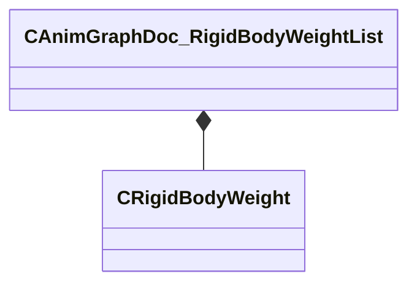

[Schemas](../../schemas.md) / [animgraphdoclib](../animgraphdoclib.md) / CAnimGraphDoc_RigidBodyWeightList

# CAnimGraphDoc_RigidBodyWeightList

> Source: **Build 25000182** · 2026-08-28 · `windows-x86_64` · schema `0.10.0`

**Kind:** class · **Size:** 40 bytes (`0x28`) · **Align:** 8 · **Module:** animgraphdoclib

**Relationships:**

## Memory layout

2 fields (2 declared here, 0 inherited). Offsets are absolute from the object base.

| Offset | Field | Type | From | Annotations |
|--------|-------|------|------|-------------|
| `0x8` | `m_name` | CUtlString |  |  |
| `0x10` | `m_weights` | CUtlVector< [CRigidBodyWeight](../animgraphdoclib/CRigidBodyWeight.md) > |  |  |

KV3 class defaults

<pre>{
	&quot;_class&quot;: &quot;CAnimGraphDoc_RigidBodyWeightList&quot;,
	&quot;m_name&quot;: &quot;Unnamed&quot;,
	&quot;m_weights&quot;:
	[
	]
}</pre>

