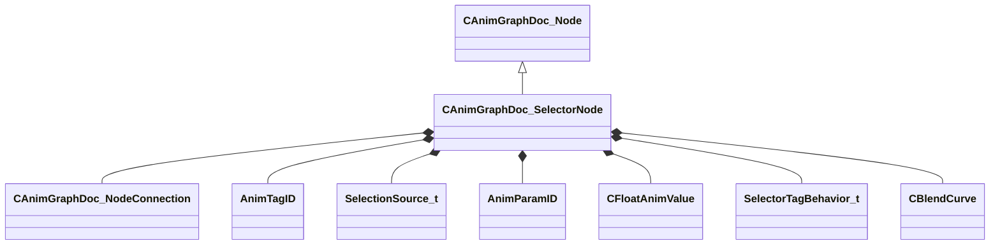

[Schemas](../../schemas.md) / [animgraphdoclib](../animgraphdoclib.md) / CAnimGraphDoc_SelectorNode

# CAnimGraphDoc_SelectorNode

> Source: **Build 25000182** · 2026-08-28 · `windows-x86_64` · schema `0.10.0`

**Kind:** class · **Size:** 208 bytes (`0xd0`) · **Align:** 8 · **Module:** animgraphdoclib

**Inherits from:** [CAnimGraphDoc_Node](../animgraphdoclib/CAnimGraphDoc_Node.md)

**Metadata:** `MPropertyFriendlyName Selector`

**Relationships:**

## Memory layout

20 fields (15 declared here, 5 inherited). Offsets are absolute from the object base.

| Offset | Field | Type | From | Annotations |
|--------|-------|------|------|-------------|
| `0x20` | `m_sName` | CUtlString | [CAnimGraphDoc_Node](../animgraphdoclib/CAnimGraphDoc_Node.md) | `MPropertyFriendlyName Name` `MPropertySortPriority 100` |
| `0x28` | `m_vecPosition` | Vector2D | [CAnimGraphDoc_Node](../animgraphdoclib/CAnimGraphDoc_Node.md) | `MPropertyGroupName Debug` `MPropertySortPriority -100` |
| `0x30` | `m_nNodeID` | [AnimNodeID](../modellib/AnimNodeID.md) | [CAnimGraphDoc_Node](../animgraphdoclib/CAnimGraphDoc_Node.md) | `MPropertyGroupName Debug` `MPropertySortPriority -100` |
| `0x34` | `m_bDebugThisNode` | bool | [CAnimGraphDoc_Node](../animgraphdoclib/CAnimGraphDoc_Node.md) | `MPropertyFriendlyName Debug This Node` `MPropertyGroupName Debug` `MPropertySortPriority -100` |
| `0x38` | `m_networkMode` | [AnimNodeNetworkMode](../animgraphlib/AnimNodeNetworkMode.md) | [CAnimGraphDoc_Node](../animgraphdoclib/CAnimGraphDoc_Node.md) | `MPropertyFriendlyName Network Mode` `MPropertySortPriority -110` |
| `0x40` | `m_children` | CUtlVector< [CAnimGraphDoc_NodeConnection](../animgraphdoclib/CAnimGraphDoc_NodeConnection.md) > |  | `MPropertySuppressField` |
| `0x58` | `m_fallbackChild` | [CAnimGraphDoc_NodeConnection](../animgraphdoclib/CAnimGraphDoc_NodeConnection.md) |  | `MPropertySuppressField` |
| `0x60` | `m_tags` | CUtlVector< [AnimTagID](../modellib/AnimTagID.md) > |  | `MPropertySuppressField` |
| `0x78` | `m_selectionSource` | [SelectionSource_t](../animgraphdoclib/SelectionSource_t.md) |  | `MPropertyAutoRebuildOnChange` `MPropertyFriendlyName Selection Source` |
| `0x80` | `m_boolParamName` | CUtlString |  | `MPropertySuppressField` |
| `0x88` | `m_boolParamID` | [AnimParamID](../modellib/AnimParamID.md) |  | `MPropertyAttrStateCallback` `MPropertyAttributeChoiceName BoolParameter` `MPropertyAutoRebuildOnChange` `MPropertyFriendlyName Bool Parameter` |
| `0x90` | `m_enumParamName` | CUtlString |  | `MPropertySuppressField` |
| `0x98` | `m_enumParamID` | [AnimParamID](../modellib/AnimParamID.md) |  | `MPropertyAttrStateCallback` `MPropertyAttributeChoiceName EnumParameter` `MPropertyAutoRebuildOnChange` `MPropertyFriendlyName Enum Parameter` |
| `0x9c` | `m_tagID` | [AnimTagID](../modellib/AnimTagID.md) |  | `MPropertyAttrStateCallback` `MPropertyAttributeChoiceName Tag` `MPropertyAutoRebuildOnChange` `MPropertyFriendlyName Tag Parameter` |
| `0xa0` | `m_blendDuration` | [CFloatAnimValue](../animgraphdoclib/CFloatAnimValue.md) |  | `MPropertyFriendlyName Blend Duration` |
| `0xc0` | `m_tagBehavior` | [SelectorTagBehavior_t](../animgraphlib/SelectorTagBehavior_t.md) |  | `MPropertyFriendlyName Tag Behavior` |
| `0xc4` | `m_bResetOnChange` | bool |  | `MPropertyFriendlyName Reset On Change` |
| `0xc5` | `m_bSyncCyclesOnChange` | bool |  | `MPropertyFriendlyName Start new option at same cycle` |
| `0xc6` | `m_bLockWhenWaning` | bool |  | `MPropertyFriendlyName Lock Selection When Waning` |
| `0xc8` | `m_blendCurve` | [CBlendCurve](../animgraphlib/CBlendCurve.md) |  | `MPropertySuppressField` |

KV3 class defaults

<pre>{
	&quot;_class&quot;: &quot;CAnimGraphDoc_SelectorNode&quot;,
	&quot;m_sName&quot;: &quot;Unnamed&quot;,
	&quot;m_vecPosition&quot;:
	[
		0.000000,
		0.000000
	],
	&quot;m_nNodeID&quot;:
	{
		&quot;m_id&quot;: &lt;HIDDEN FOR DIFF&gt;,
	},
	&quot;m_bDebugThisNode&quot;: false,
	&quot;m_networkMode&quot;: &quot;ServerAuthoritative&quot;,
	&quot;m_children&quot;:
	[
	],
	&quot;m_fallbackChild&quot;:
	{
		&quot;m_nodeID&quot;:
		{
			&quot;m_id&quot;: &lt;HIDDEN FOR DIFF&gt;,
		},
		&quot;m_outputID&quot;:
		{
			&quot;m_id&quot;: &lt;HIDDEN FOR DIFF&gt;,
		}
	},
	&quot;m_tags&quot;:
	[
	],
	&quot;m_selectionSource&quot;: &quot;SelectionSource_Enum&quot;,
	&quot;m_boolParamName&quot;: &quot;&quot;,
	&quot;m_boolParamID&quot;:
	{
		&quot;m_id&quot;: &lt;HIDDEN FOR DIFF&gt;,
	},
	&quot;m_enumParamName&quot;: &quot;&quot;,
	&quot;m_enumParamID&quot;:
	{
		&quot;m_id&quot;: &lt;HIDDEN FOR DIFF&gt;,
	},
	&quot;m_tagID&quot;:
	{
		&quot;m_id&quot;: &lt;HIDDEN FOR DIFF&gt;,
	},
	&quot;m_blendDuration&quot;:
	{
		&quot;_class&quot;: &quot;CFloatAnimValue&quot;,
		&quot;m_flConstValue&quot;: 0.200000,
		&quot;m_paramName&quot;: &quot;&quot;,
		&quot;m_paramID&quot;:
		{
			&quot;m_id&quot;: &lt;HIDDEN FOR DIFF&gt;,
		},
		&quot;m_eSource&quot;: &quot;Constant&quot;
	},
	&quot;m_tagBehavior&quot;: &quot;SelectorTagBehavior_OffWhenFinished&quot;,
	&quot;m_bResetOnChange&quot;: true,
	&quot;m_bSyncCyclesOnChange&quot;: false,
	&quot;m_bLockWhenWaning&quot;: false,
	&quot;m_blendCurve&quot;:
	{
		&quot;m_flControlPoint1&quot;: 0.000000,
		&quot;m_flControlPoint2&quot;: 1.000000
	}
}</pre>

