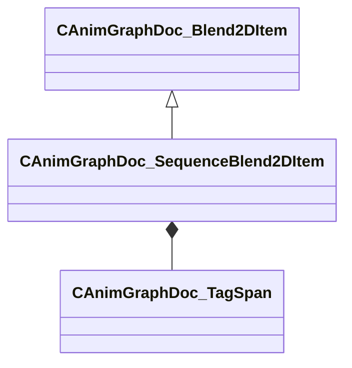

[Schemas](../../schemas.md) / [animgraphdoclib](../animgraphdoclib.md) / CAnimGraphDoc_SequenceBlend2DItem

# CAnimGraphDoc_SequenceBlend2DItem

**Kind:** class · **Size:** 88 bytes (`0x58`) · **Align:** 8 · **Module:** animgraphdoclib

**Inherits from:** [CAnimGraphDoc_Blend2DItem](../animgraphdoclib/CAnimGraphDoc_Blend2DItem.md)

**Metadata:** `MPropertyElementNameFn`, `MPropertyFriendlyName Sequence Blend Item`

**Relationships:**

## Memory layout

5 fields (2 declared here, 3 inherited). Offsets are absolute from the object base.

| Offset | Field | Type | From | Annotations |
|--------|-------|------|------|-------------|
| `0x18` | `m_blendValue` | Vector2D | [CAnimGraphDoc_Blend2DItem](../animgraphdoclib/CAnimGraphDoc_Blend2DItem.md) | `MPropertyFriendlyName Blend Value` |
| `0x28` | `m_bUseCustomDuration` | bool | [CAnimGraphDoc_Blend2DItem](../animgraphdoclib/CAnimGraphDoc_Blend2DItem.md) | `MPropertyAutoRebuildOnChange` `MPropertyFriendlyName Use Custom Duration` `MPropertyGroupName +Duration Override` |
| `0x2c` | `m_flCustomDuration` | float32 | [CAnimGraphDoc_Blend2DItem](../animgraphdoclib/CAnimGraphDoc_Blend2DItem.md) | `MPropertyAttrStateCallback` `MPropertyFriendlyName Custom Duration` `MPropertyGroupName +Duration Override` |
| `0x38` | `m_tagSpans` | CUtlVector< CSmartPtr< [CAnimGraphDoc_TagSpan](../animgraphdoclib/CAnimGraphDoc_TagSpan.md) > > |  | `MPropertySuppressField` |
| `0x50` | `m_sequenceName` | CUtlString |  | `MPropertyAttributeChoiceName Sequence` `MPropertyFriendlyName Sequence` |

KV3 class defaults

<pre>{
	&quot;_class&quot;: &quot;CAnimGraphDoc_SequenceBlend2DItem&quot;,
	&quot;m_blendValue&quot;:
	[
		0.000000,
		0.000000
	],
	&quot;m_bUseCustomDuration&quot;: false,
	&quot;m_flCustomDuration&quot;: 0.000000,
	&quot;m_tagSpans&quot;:
	[
	],
	&quot;m_sequenceName&quot;: &quot;&quot;
}</pre>

