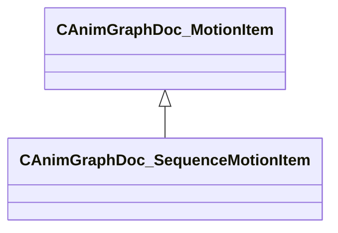

[Schemas](../../schemas.md) / [animgraphdoclib](../animgraphdoclib.md) / CAnimGraphDoc_SequenceMotionItem

# CAnimGraphDoc_SequenceMotionItem

> Source: **Build 25000182** · 2026-08-28 · `windows-x86_64` · schema `0.10.0`

**Kind:** class · **Size:** 176 bytes (`0xb0`) · **Align:** 8 · **Module:** animgraphdoclib

**Inherits from:** [CAnimGraphDoc_MotionItem](../animgraphdoclib/CAnimGraphDoc_MotionItem.md)

**Metadata:** `MPropertyFriendlyName Sequence`

**Relationships:**

## Memory layout

6 fields (1 declared here, 5 inherited). Offsets are absolute from the object base.

| Offset | Field | Type | From | Annotations |
|--------|-------|------|------|-------------|
| `0x28` | `m_paramManager` | [CAnimGraphDoc_MotionParameterManager](../animgraphdoclib/CAnimGraphDoc_MotionParameterManager.md) | [CAnimGraphDoc_MotionItem](../animgraphdoclib/CAnimGraphDoc_MotionItem.md) | `MPropertySuppressField` |
| `0x50` | `m_blockSpans` | CUtlVector< CSmartPtr< [CAnimGraphDoc_TagSpan](../animgraphdoclib/CAnimGraphDoc_TagSpan.md) > > | [CAnimGraphDoc_MotionItem](../animgraphdoclib/CAnimGraphDoc_MotionItem.md) | `MPropertySuppressField` |
| `0x68` | `m_tagSpans` | CUtlVector< CSmartPtr< [CAnimGraphDoc_TagSpan](../animgraphdoclib/CAnimGraphDoc_TagSpan.md) > > | [CAnimGraphDoc_MotionItem](../animgraphdoclib/CAnimGraphDoc_MotionItem.md) | `MPropertySuppressField` |
| `0x80` | `m_paramSpans` | CUtlVector< CSmartPtr< [CAnimGraphDoc_ParamSpan](../animgraphdoclib/CAnimGraphDoc_ParamSpan.md) > > | [CAnimGraphDoc_MotionItem](../animgraphdoclib/CAnimGraphDoc_MotionItem.md) | `MPropertySuppressField` |
| `0xa0` | `m_bLoop` | bool | [CAnimGraphDoc_MotionItem](../animgraphdoclib/CAnimGraphDoc_MotionItem.md) | `MPropertyFriendlyName Loop` |
| `0xa8` | `m_sequenceName` | CUtlString |  | `MPropertyAttributeChoiceName Sequence` `MPropertyFriendlyName Sequence` |

KV3 class defaults

<pre>{
	&quot;_class&quot;: &quot;CAnimGraphDoc_SequenceMotionItem&quot;,
	&quot;m_paramManager&quot;:
	{
		&quot;_class&quot;: &quot;CAnimGraphDoc_MotionParameterManager&quot;,
		&quot;m_params&quot;:
		[
		]
	},
	&quot;m_blockSpans&quot;:
	[
	],
	&quot;m_tagSpans&quot;:
	[
	],
	&quot;m_paramSpans&quot;:
	[
	],
	&quot;m_bLoop&quot;: false,
	&quot;m_sequenceName&quot;: &quot;&quot;
}</pre>

