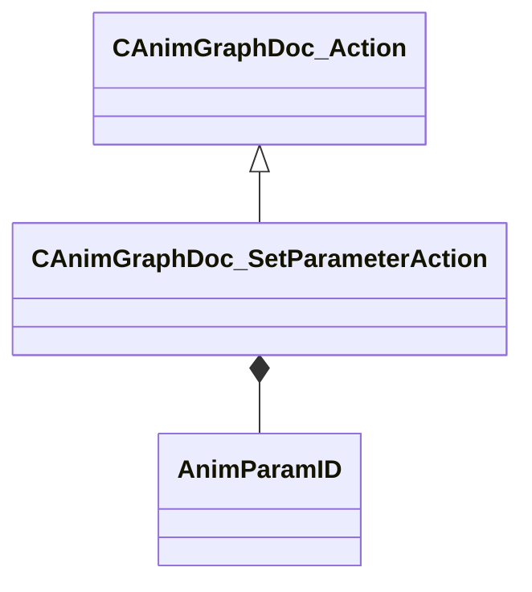

[Schemas](../../schemas.md) / [animgraphdoclib](../animgraphdoclib.md) / CAnimGraphDoc_SetParameterAction

# CAnimGraphDoc_SetParameterAction

**Kind:** class · **Size:** 72 bytes (`0x48`) · **Align:** 8 · **Module:** animgraphdoclib

**Inherits from:** [CAnimGraphDoc_Action](../animgraphdoclib/CAnimGraphDoc_Action.md)

**Relationships:**

## Memory layout

3 fields (3 declared here, 0 inherited). Offsets are absolute from the object base.

| Offset | Field | Type | From | Annotations |
|--------|-------|------|------|-------------|
| `0x28` | `m_paramName` | CUtlString |  | `MPropertyHideField` |
| `0x30` | `m_param` | [AnimParamID](../modellib/AnimParamID.md) |  | `MPropertyAttributeChoiceName Parameter` `MPropertyFriendlyName Parameter` |
| `0x34` | `m_value` | CAnimVariant |  | `MPropertyFriendlyName Value` |

KV3 class defaults

<pre>{
	&quot;_class&quot;: &quot;CAnimGraphDoc_SetParameterAction&quot;,
	&quot;m_paramName&quot;: &quot;&quot;,
	&quot;m_param&quot;:
	{
		&quot;m_id&quot;: &lt;HIDDEN FOR DIFF&gt;,
	},
	&quot;m_value&quot;:
	{
		&quot;m_nType&quot;: 0
	}
}</pre>

