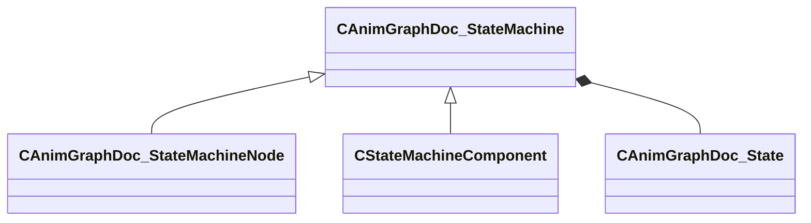

[Schemas](../../schemas.md) / [animgraphdoclib](../animgraphdoclib.md) / CAnimGraphDoc_StateMachine

# CAnimGraphDoc_StateMachine

> Source: **Build 25000182** · 2026-08-28 · `windows-x86_64` · schema `0.10.0`

**Kind:** class · **Size:** 40 bytes (`0x28`) · **Align:** 8 · **Module:** animgraphdoclib

**Derived by:** [CAnimGraphDoc_StateMachineNode](../animgraphdoclib/CAnimGraphDoc_StateMachineNode.md), [CStateMachineComponent](../animgraphdoclib/CStateMachineComponent.md)

**Metadata:** `MPropertyFriendlyName State Machine`

**Relationships:**

## Memory layout

1 field (1 declared here, 0 inherited). Offsets are absolute from the object base.

| Offset | Field | Type | From | Annotations |
|--------|-------|------|------|-------------|
| `0x8` | `m_states` | CUtlVector< CSmartPtr< [CAnimGraphDoc_State](../animgraphdoclib/CAnimGraphDoc_State.md) > > |  | `MPropertyHideField` |

KV3 class defaults

<pre>{
	&quot;_class&quot;: &quot;CAnimGraphDoc_StateMachine&quot;,
	&quot;m_states&quot;:
	[
	]
}</pre>

