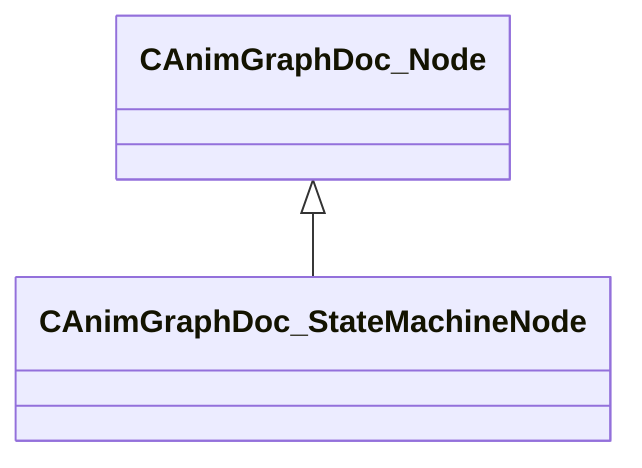

[Schemas](../../schemas.md) / [animgraphdoclib](../animgraphdoclib.md) / CAnimGraphDoc_StateMachineNode

# CAnimGraphDoc_StateMachineNode

**Kind:** class · **Size:** 112 bytes (`0x70`) · **Align:** 8 · **Module:** animgraphdoclib

**Inherits from:** [CAnimGraphDoc_Node](../animgraphdoclib/CAnimGraphDoc_Node.md), [CAnimGraphDoc_StateMachine](../animgraphdoclib/CAnimGraphDoc_StateMachine.md)

**Metadata:** `MPropertyFriendlyName State Machine`

**Relationships:**

## Memory layout

8 fields (3 declared here, 5 inherited). Offsets are absolute from the object base.

| Offset | Field | Type | From | Annotations |
|--------|-------|------|------|-------------|
| `0x20` | `m_sName` | CUtlString | [CAnimGraphDoc_Node](../animgraphdoclib/CAnimGraphDoc_Node.md) | `MPropertyFriendlyName Name` `MPropertySortPriority 100` |
| `0x28` | `m_vecPosition` | Vector2D | [CAnimGraphDoc_Node](../animgraphdoclib/CAnimGraphDoc_Node.md) | `MPropertyGroupName Debug` `MPropertySortPriority -100` |
| `0x30` | `m_nNodeID` | [AnimNodeID](../modellib/AnimNodeID.md) | [CAnimGraphDoc_Node](../animgraphdoclib/CAnimGraphDoc_Node.md) | `MPropertyGroupName Debug` `MPropertySortPriority -100` |
| `0x34` | `m_bDebugThisNode` | bool | [CAnimGraphDoc_Node](../animgraphdoclib/CAnimGraphDoc_Node.md) | `MPropertyFriendlyName Debug This Node` `MPropertyGroupName Debug` `MPropertySortPriority -100` |
| `0x38` | `m_networkMode` | [AnimNodeNetworkMode](../animgraphlib/AnimNodeNetworkMode.md) | [CAnimGraphDoc_Node](../animgraphdoclib/CAnimGraphDoc_Node.md) | `MPropertyFriendlyName Network Mode` `MPropertySortPriority -110` |
| `0x68` | `m_bBlockWaningTags` | bool |  | `MPropertyFriendlyName Block Tags from Waning States` |
| `0x69` | `m_bLockStateWhenWaning` | bool |  | `MPropertyFriendlyName Lock When Waning` |
| `0x6a` | `m_bResetWhenActivated` | bool |  | `MPropertyFriendlyName Reset When Activated` |

**Also inherits (secondary base classes):** [CAnimGraphDoc_StateMachine](../animgraphdoclib/CAnimGraphDoc_StateMachine.md) — additional-base fields sit at a shifted offset the schema does not record; see each base's own page for its layout.

KV3 class defaults

<pre>{
	&quot;_class&quot;: &quot;CAnimGraphDoc_StateMachineNode&quot;,
	&quot;m_sName&quot;: &quot;Unnamed&quot;,
	&quot;m_vecPosition&quot;:
	[
		0.000000,
		0.000000
	],
	&quot;m_nNodeID&quot;:
	{
		&quot;m_id&quot;: &lt;HIDDEN FOR DIFF&gt;,
	},
	&quot;m_bDebugThisNode&quot;: false,
	&quot;m_networkMode&quot;: &quot;ServerAuthoritative&quot;,
	&quot;m_states&quot;:
	[
	],
	&quot;m_bBlockWaningTags&quot;: false,
	&quot;m_bLockStateWhenWaning&quot;: false,
	&quot;m_bResetWhenActivated&quot;: false
}</pre>

