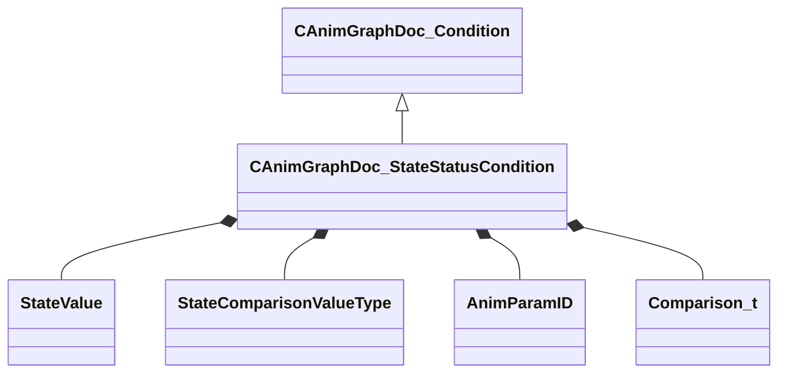

[Schemas](../../schemas.md) / [animgraphdoclib](../animgraphdoclib.md) / CAnimGraphDoc_StateStatusCondition

# CAnimGraphDoc_StateStatusCondition

**Kind:** class · **Size:** 72 bytes (`0x48`) · **Align:** 8 · **Module:** animgraphdoclib

**Inherits from:** [CAnimGraphDoc_Condition](../animgraphdoclib/CAnimGraphDoc_Condition.md)

**Metadata:** `MPropertyFriendlyName State Status Condition`

**Relationships:**

## Memory layout

7 fields (7 declared here, 0 inherited). Offsets are absolute from the object base.

| Offset | Field | Type | From | Annotations |
|--------|-------|------|------|-------------|
| `0x28` | `m_sourceValue` | [StateValue](../!GlobalTypes/StateValue.md) |  |  |
| `0x2c` | `m_comparisonValueType` | [StateComparisonValueType](../!GlobalTypes/StateComparisonValueType.md) |  |  |
| `0x30` | `m_comparisonFixedValue` | float32 |  |  |
| `0x34` | `m_comparisonStateValue` | [StateValue](../!GlobalTypes/StateValue.md) |  |  |
| `0x38` | `m_comparisonParamName` | CUtlString |  |  |
| `0x40` | `m_comparisonParamID` | [AnimParamID](../modellib/AnimParamID.md) |  |  |
| `0x44` | `m_comparisonOp` | [Comparison_t](../!GlobalTypes/Comparison_t.md) |  |  |

KV3 class defaults

<pre>{
	&quot;_class&quot;: &quot;CAnimGraphDoc_StateStatusCondition&quot;,
	&quot;m_sourceValue&quot;: &quot;SourceStateBlendWeight&quot;,
	&quot;m_comparisonValueType&quot;: &quot;StateComparisonValue_FixedValue&quot;,
	&quot;m_comparisonFixedValue&quot;: 0.000000,
	&quot;m_comparisonStateValue&quot;: &quot;SourceStateBlendWeight&quot;,
	&quot;m_comparisonParamName&quot;: &quot;&quot;,
	&quot;m_comparisonParamID&quot;:
	{
		&quot;m_id&quot;: &lt;HIDDEN FOR DIFF&gt;,
	},
	&quot;m_comparisonOp&quot;: &quot;COMPARISON_EQUALS&quot;
}</pre>

