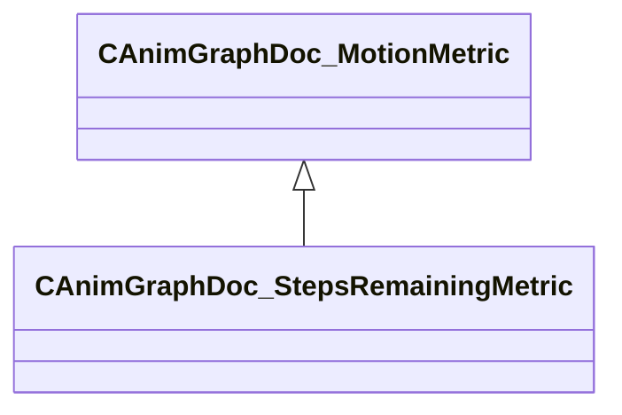

[Schemas](../../schemas.md) / [animgraphdoclib](../animgraphdoclib.md) / CAnimGraphDoc_StepsRemainingMetric

# CAnimGraphDoc_StepsRemainingMetric

**Kind:** class · **Size:** 72 bytes (`0x48`) · **Align:** 8 · **Module:** animgraphdoclib

**Inherits from:** [CAnimGraphDoc_MotionMetric](../animgraphdoclib/CAnimGraphDoc_MotionMetric.md)

**Metadata:** `MPropertyFriendlyName Steps Remaining Metric`

**Relationships:**

## Memory layout

3 fields (2 declared here, 1 inherited). Offsets are absolute from the object base.

| Offset | Field | Type | From | Annotations |
|--------|-------|------|------|-------------|
| `0x20` | `m_flWeight` | float32 | [CAnimGraphDoc_MotionMetric](../animgraphdoclib/CAnimGraphDoc_MotionMetric.md) | `MPropertySuppressField` |
| `0x28` | `m_feet` | CUtlVector< CUtlString > |  | `MPropertyAttributeChoiceName Foot` `MPropertyAutoExpandSelf` `MPropertyFriendlyName Feet` |
| `0x40` | `m_flMinStepsRemaining` | float32 |  | `MPropertyFriendlyName Min Steps Remaining` |

KV3 class defaults

<pre>{
	&quot;_class&quot;: &quot;CAnimGraphDoc_StepsRemainingMetric&quot;,
	&quot;m_flWeight&quot;: 0.000000,
	&quot;m_feet&quot;:
	[
	],
	&quot;m_flMinStepsRemaining&quot;: 1.000000
}</pre>

