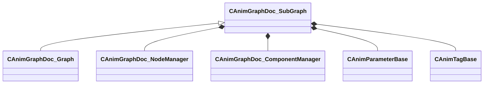

[Schemas](../../schemas.md) / [animgraphdoclib](../animgraphdoclib.md) / CAnimGraphDoc_SubGraph

# CAnimGraphDoc_SubGraph

**Kind:** class · **Size:** 224 bytes (`0xe0`) · **Align:** 8 · **Module:** animgraphdoclib

**Derived by:** [CAnimGraphDoc_Graph](../animgraphdoclib/CAnimGraphDoc_Graph.md)

**Relationships:**

## Memory layout

6 fields (6 declared here, 0 inherited). Offsets are absolute from the object base.

| Offset | Field | Type | From | Annotations |
|--------|-------|------|------|-------------|
| `0x8` | `m_nodeManager` | [CAnimGraphDoc_NodeManager](../animgraphdoclib/CAnimGraphDoc_NodeManager.md) |  |  |
| `0x50` | `m_componentManager` | [CAnimGraphDoc_ComponentManager](../animgraphdoclib/CAnimGraphDoc_ComponentManager.md) |  |  |
| `0x78` | `m_localParameters` | CUtlVector< CSmartPtr< [CAnimParameterBase](../animgraphlib/CAnimParameterBase.md) > > |  |  |
| `0x90` | `m_localTags` | CUtlVector< CSmartPtr< [CAnimTagBase](../animgraphlib/CAnimTagBase.md) > > |  |  |
| `0xa8` | `m_referencedParamGroups` | CUtlVector< CUtlString > |  |  |
| `0xc0` | `m_referencedTagGroups` | CUtlVector< CUtlString > |  |  |

KV3 class defaults

<pre>{
	&quot;_class&quot;: &quot;CAnimGraphDoc_SubGraph&quot;,
	&quot;m_nodeManager&quot;:
	{
		&quot;_class&quot;: &quot;CAnimGraphDoc_NodeManager&quot;,
		&quot;m_nodes&quot;:
		[
		]
	},
	&quot;m_componentManager&quot;:
	{
		&quot;_class&quot;: &quot;CAnimGraphDoc_ComponentManager&quot;,
		&quot;m_components&quot;:
		[
		]
	},
	&quot;m_localParameters&quot;:
	[
	],
	&quot;m_localTags&quot;:
	[
	],
	&quot;m_referencedParamGroups&quot;:
	[
	],
	&quot;m_referencedTagGroups&quot;:
	[
	]
}</pre>

